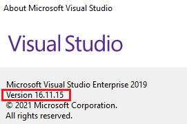

/*
Title: Installation Instructions
Description: How to install PHP Tools for Visual Studio
*/

## Basic Installation

You will need to have *Microsoft Visual Studio* installed before installing PHP Tools. You can download the free Community version [here](https://visualstudio.microsoft.com/vs/community/) or use any other Visual Studio version, except for Express versions, which are not supported.

If you already have Microsoft Visual Studio installed, you can jump directly to the **Manage Extensions** dialog and search for **PHP Tools for Visual Studio**.


Once downloaded, you'll be prompted to close Visual Studio. The package will be installed and Visual Studio configured for the PHP development. After starting Visual Studio next time, you can proceed to the [product activation](activation.md) and [get started](../index.md).

If you would like more detailed steps, please, continue reading.

## Prerequisites

To install PHP Tools for Visual Studio, you'll need:

- **Administrator access**. Please ensure you can provide administrator access to your hard drive because the installation package copies files to the system's _AppData_. For Visual Studio 2010 up to 2015, you'll be queried to allow access to the system's _Program Files_*.

- **Microsoft Visual Studio**. Install [Microsoft Visual Studio](https://visualstudio.microsoft.com/vs/). You can choose the **Community** edition, which is the **free**** option, or any other Visual Studio´s supported editions, such as *Professional*, *Enterprise* or higher. Express editions are not supported.

## Download and Installation

 PHP Tools installation package can be downloaded from:

- [Visual Studio Marketplace](https://marketplace.visualstudio.com/search?term="php%20tools"&target=VS&vsVersion=) - Choose PHP Tools edition according to the version of your Visual Studio.

- [DEVSENSE.com](https://www.devsense.com/en/download#vs) - You can download any version or any update of PHP Tools for Visual Studio directly from our WebSite.


### Instructions for Installation

1. Close *Visual Studio*
2. Run the installation package downloaded from any of the locations above
3. Follow the instructions on the screen.
4. Restart *Visual Studio*.

The software's installation package can also be used for an [Offline Activation](offline-activation.md).

## Activation

The product contains both a 30-day trial and a full product. When the trial is over, you can activate the software using a purchased license key. Please see [Product Activation](activation.md) for more details.

## Updates

PHP Tools updates are checked automatically. Visual Studio will notify you about updates available. Please see [Update Instructions](update.md) for more information.

## Troubleshooting

### PHP Tools cannot be found on VS Marketplace

The most probable cause is that you are running an older Visual Studio version. Please update to the latest VS version.

In Visual Studio, go to `Help`, and click `Check for Updates`.  Then in Visual Studio Installer, click on `Update`.

### VSIXInstaller.NoApplicableSKUsException: This extension is not installable on any currently installed products.

If you see this message in the VSIX Installer log, it usually means you will need to update your Visual Studio.

You can see which VS version is a minimal supported version in the VSIX Installer log. There is a section specifying the supported VS version range:
```
26-7-2022 11:33:05 - Supported Products :
26-7-2022 11:33:05 -   Microsoft.VisualStudio.Community
26-7-2022 11:33:05 -     Version : [16.10,17.0)
```
In this case, the lowest supported version is `16.10`.

To see which Visual Studio version are you running, go to `Help`, and click `About Microsoft Visual Studio`:



If you see a version higher than the one from the VSIX Installer log, then please contact us at [info@devsense.com](mailto:info@devsense.com).

Otherwise please update your Visual Studio by opening `Help` menu and clicking `Check for Updates`. Then in Visual Studio Installer, click on `Update`.
