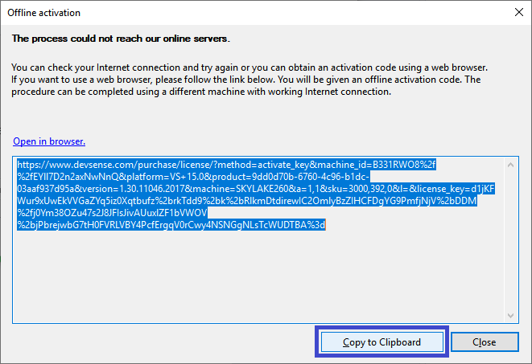
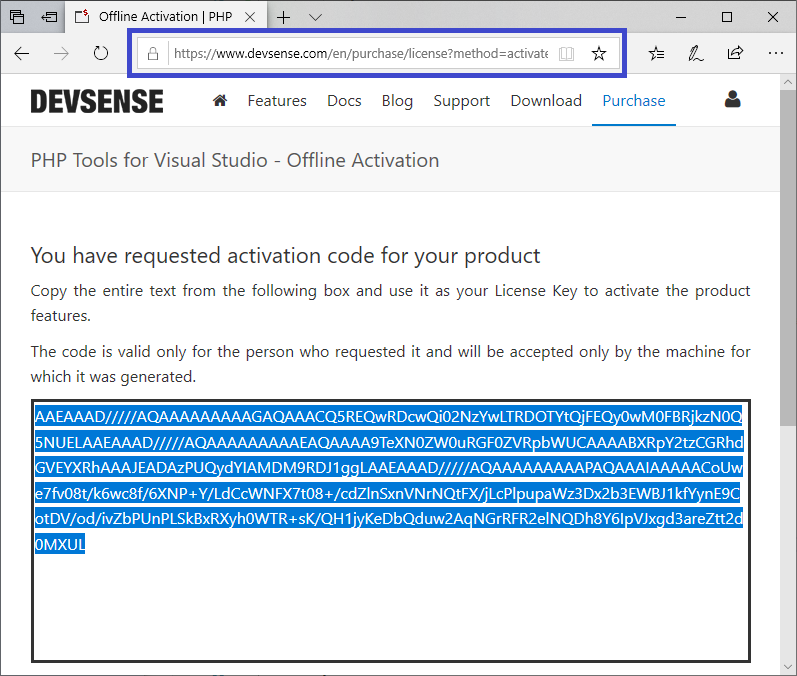
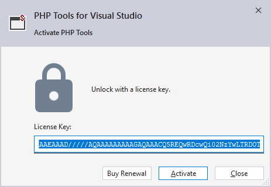

/*
Title: Product Offline Activation
Description: Activate PHP Tools for Visual Studio Offline
*/

## Offline Activation

In case there is no Internet connection available or the Internet is blocked by company policies, PHP Tools activation can be processed in a web browser on another machine with a working Internet connection.

To access offline activation, proceed to the normal product activation by entering your license key, as shown in the picture above. The activation dialog will popup a message saying it cannot reach the server and will **provide an alternate URL** that can be copied and opened in a web browser with working connection (see picture below).

After opening the URL in the web browser, the page generates an offline key (*a long-base64-encoded text*) which can be copied and pasted back to the activation dialog, instead of the regular license key.

> Note: the offline key only works for the machine which gave you the alternate URL.

## Subscription Status

If you want to check your subscription status, please visit [www.devsense.com/account/dashboard](https://www.devsense.com/account/dashboard).

You will have to create an account or login with an existing social account to see your subscription and license status.

**Important**: When you create an account at Devsense or login using your social account, you must use **the same email you used to purchase the license**. If you are not sure which email it was, please, feel free to [contact us](mailto:info@devsense.com).

