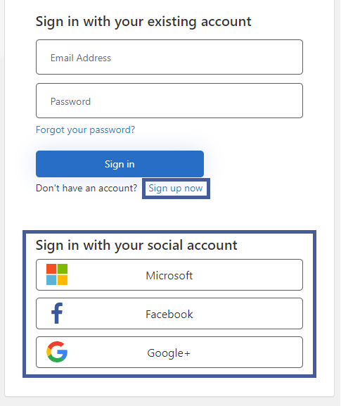
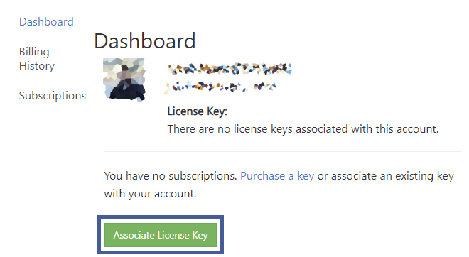
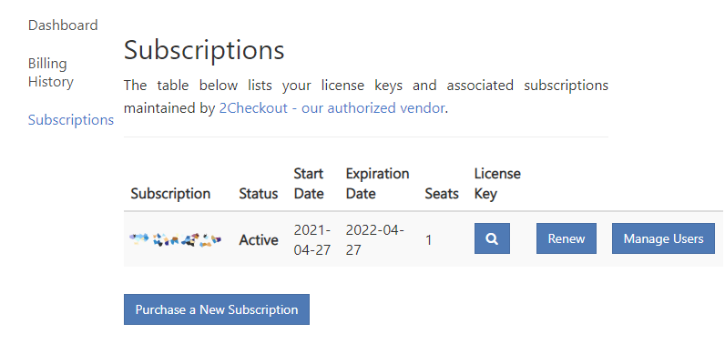
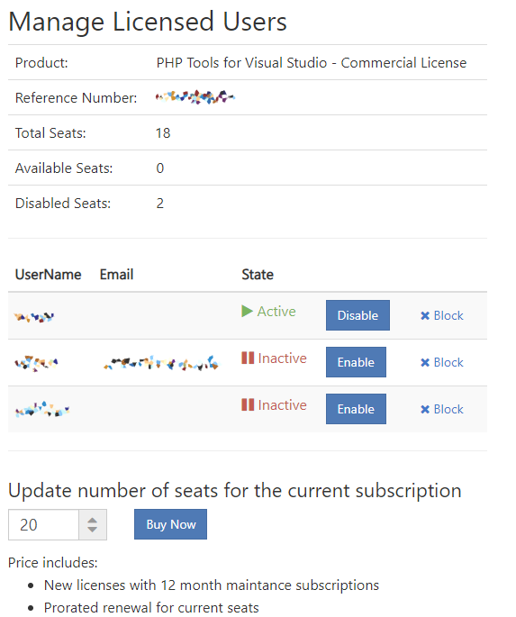
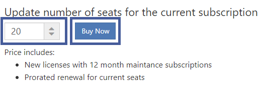

/*
Title: Subscriptions
Description: Managing your subscription, users, and seats
*/

# Subscriptions

The software needs to be activated using a license key. For the initial purchase and [frequently asked questions](https://www.devsense.com/purchase#faq), please see [devsense.com/purchase](https://www.devsense.com/purchase).

## Dashboard

Existing subscriptions and license keys can be managed at our [dashboard](https://www.devsense.com/account/dashboard) (upper right icon at our Web Site).

1. Create an account at the **[login/register page](https://www.devsense.com/account/login)**. You can instantly login using a social account or you can create a new account with email. The login information supplied from the vendor (*2checkout*) does not work here.

    Don't forget to click **[Send verification code]** button after filling up the e-mail address.

    

2. The dashboard lists license keys associated with your account. In case there are no keys yet, add it to your account using the **[Associate License Key]** button.

    

## Subscriptions

The dashboard provides information about active and past subscriptions. It lists the subscriptions, shows the expiration dates, lets you to renew it, or to manage users actively using your subscription.

## Manage Users

Under the **Subscriptions** page, each subscription lets you to **Manage Users**. Here users can be disabled to increase the available seats number, or to **extend seats** by purchasing additional seats for more users.

- **Active** state signalizes a user that activated the license on his machine.
- **Inactive** state signalizes a user that has been disabled, or a user that could not activate the product due to insufficient seats count.
- **Disable** button frees the taken seat, and deactivates the user.
- **Block** disallows user to activate the product.

## Purchase more seats

The **Manage Users** page above allows to quickly increase the subscription seats count. Whenever there are more active users than the license was purchased for, the number can be increased at this page.

The number represents **the total number** of seats after the purchase. Extending the number of seats also renews the subscription. The price is calculated as new seats price after the quantity discount, plus the renewal price accordingly to the expiration date.

---

For more information about subscriptions and licensing, please see the [frequently asked questions](https://www.devsense.com/purchase#faq).