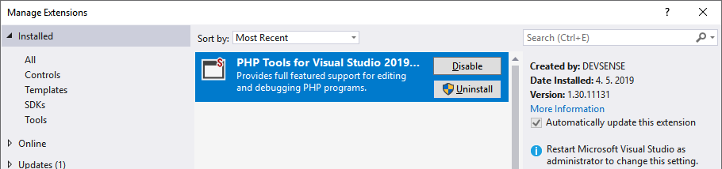

/*
Title: Uninstall
Description: Uninstall PHP Tools for Visual Studio
*/

# Uninstall

## Visual Studio 2017 or higher

Go to Visual Studio's **Extension Manager** in `Tools | Extensions and Updates` (Visual Studio 2017) or `Extensions | Manage Extensions` (Visual Studio 2019 or newer).

Any new installation, update or removal requires restarting Visual Studio. The user is notified about that, and it is recommended to perform installations or updates while other Visual Studio instances are closed.

## Visual Studio 2010 - 2015

PHP Tools for Visual Studio is installed through the Windows Installer. Use **Programs and Features** in Windows Control Panel for repair, change or uninstall.

> Note: The extension is listed in Visual Studio in `Tools | Extension Manager` without the option to uninstall.

## Uninstall previous versions

PHP Tools for Visual Studio versions lower than 1.11 were standard Visual Studio extension (`.vsix`). Installing, updating and removing this extension is managed through Visual Studio Extension Manager (see below).
