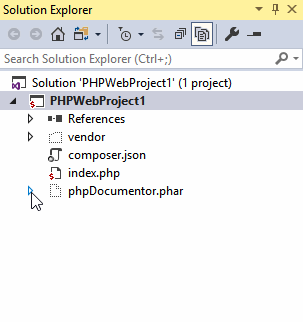

/*
Title: Solution Explorer
Description: Using Solution Explorer
*/

# Solution Explorer

Solution Explorer window lists all the projects and contained files. The window is used to navigate to files, include/exclude files from the project, manage project references and properties.

## Project Properties

Right clicking the project node shows several additional operations including `Properties`. The menu command opens project properties allowing to setup a project start action and other project-specific options.

## Project Files

The Solution Explorer lists files included in the project. In addition to that, files not included in the project but contained in the project folder can be shown using the 'Show All Files' button at the top of Solution Explorer.

### Adding Files

Files can be added to the project in several ways:

- Right click the project or contained folder and choose `Add | Existing Item...`.
- Use `Show All Files`. Click on files or folders you would like to add to the project and choose `Include In Project`.
- Drag and drop files and folders from Windows Explorer.

### Filtering View

Projects can be large, so the Solution Explorer helps filtering its content by partially typed name. The *Search Solution Explorer* input box is at the top of the window. The box can be focused by <kbd>Ctrl+;</kbd> by default. Typing text filters files immediately.

## PHAR Archives

The Solution Explorer allows for inspecting of PHAR archives (`.phar` files). Expanding the file node reveals the content of the PHAR archive including the stub file and content files. Single contained files can be opened but not edited.

> The IntelliSense (code completion, tool tips and navigation features) provides declarations contained in PHAR archives as well.

## Composer Packages

Every PHP project contains a `References` node. The node lists used composer packages in a tree hierarchy. See [Composer](http://docs.devsense.com/project/composer) for more information.
