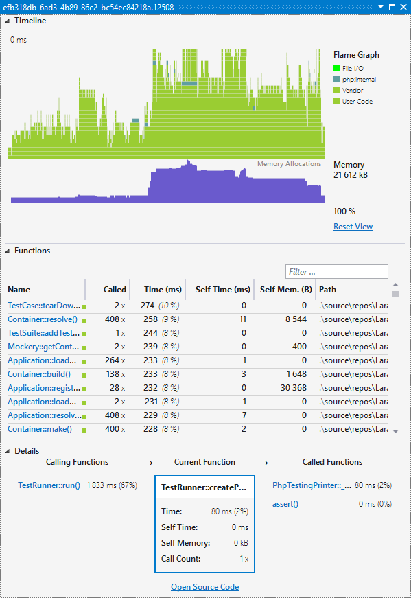

/*
Title: Details View
Description: Displaying profiling details in a Profiler View window.
Version: 1.73 and higher
*/

# Details View

Results with the profiling data are opened either from [Profiling Tool Window](overview) or [Test Explorer](profiling-phpunit-tests).

The _Profiler Details View_ provides details about called functions, call graphs, memory allocations, and functions called in time. It allows for filtering by a function name, path, or whether it's a PHP internal or user function.

### Timeline

_Timeline_ features a so-called _flame graph_ of function calls. It depicts functions called in time, and their call stack.

**Zoom in/out** using a mouse wheel.

**Colors** depict various function _category_; whether it corresponds to an internal PHP function, a function from `vendor` folder, or if it's a user function. Functions within categories can be hidden by clicking on the category legend on the right.

### Functions

List of all the called functions including their

- **Called**: call count.
- **Time**: time that includes calls of other functions within.
- **Self Time**
- **Self Mem**: memory allocated within the function call.
- **Path**: locatiom of the function declaration.

The list can be filtered quickly using the **Filter ...** test box. It respects the original Xdebug identifier as stored in the cachegrind data file, so you can take advantage, for example, of the following terms:

- `->`: instance method call.
- `php:` only internal function.
- `closure` only anonymous functions.

### Details

The boxes show details of a function, and all the function that called it, and all the functions being called. Navigate through this call graph by clicking onto the function names.

## See also

- [Profiler View](profiler-view)
- [Profiling PHPUnit Tests](profiling-phpunit-tests)
- [Installing PHP with Xdebug](../Installation/install-php)
- [Custom Xdebug configuration](../Debugging/configuring-xdebug)