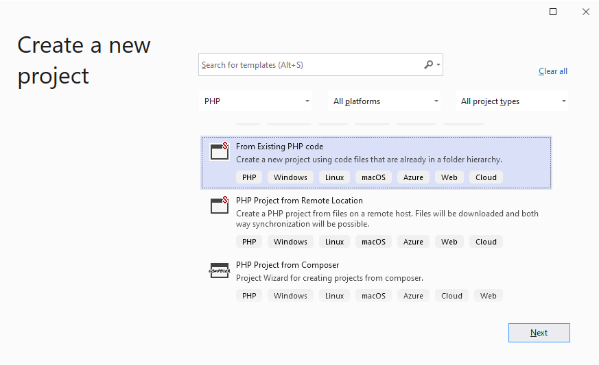
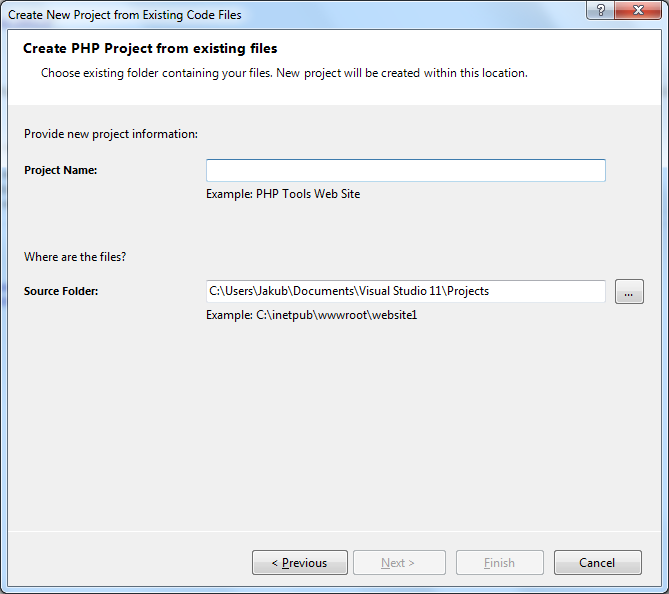

/*
Title: New Project from Existing Code
Description: Create PHP Project from Existing Code
*/

# New Project from Existing Code

If there is already a folder with existing PHP code files, a new Visual Studio project can be created right from there.

## Project From Existing Code "Project Template"

In `File` / `New` / `Project`, choose the `From Existing PHP code` project template. The wizard will guie you through the process of creating the project in the specified location.

## Project From Existing Code Menu

Open `File | New | Project From Existing Code...` (if available).

Then select **PHP** and click **Next >**

This will display the following wizard. Choose a name for your new project, the root folder containing the existing code, and a filter to ignore specific file types.

Click **Finish**, Visual Studio will create a new project (`.phpproj`) in the folder you specified, containing all the files within this folder.

In case your folder contains `composer.json` file and you are missing the required packages defined in the file, the following dialog will appear, asking for your permission to download the package into your project.

## Related links

- [New Project](new-project) - creating a new PHP project, either empty or from a template.
- [New Project from Composer Package](new-project-composer) - creating a new PHP project from a composer package.
- [New Project from Remote location](new-project-remote) - creating a new PHP project that is initialized with files from a remote location, and setups both-way synchronization.