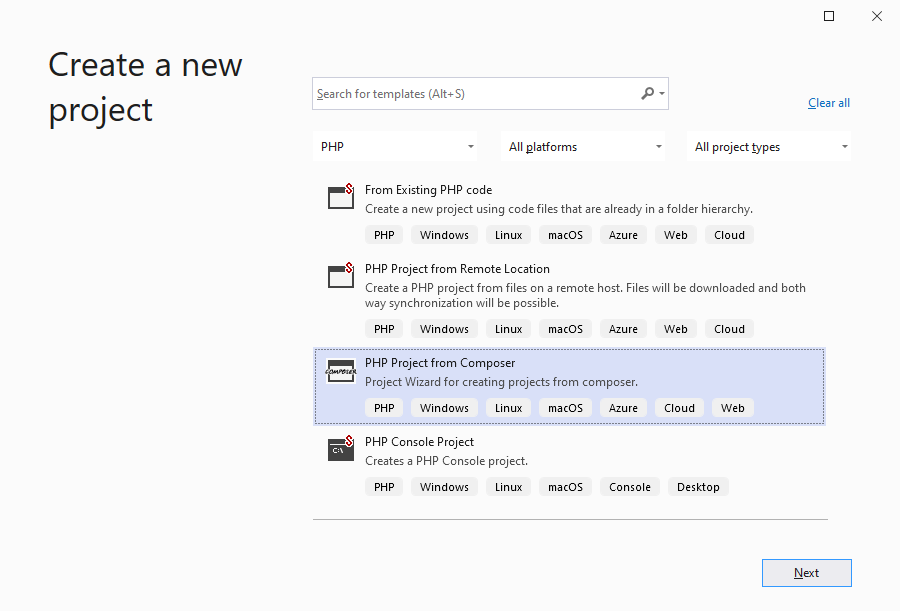
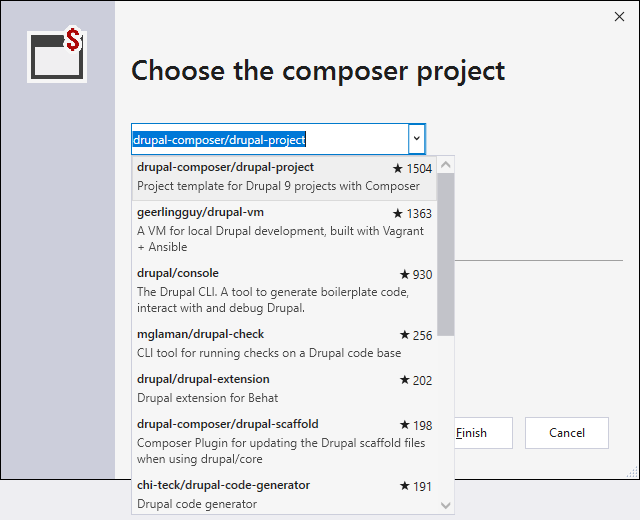

/*
Title: New Project from Composer
Description: Creating new PHP project from a composer project
*/

# New Project from Composer

Project template for creating and initializing a new PHP project from with a composer project or a composer package is named `PHP Project from Composer`.

Open the New Project window in `File` / `New` / `Project` menu, choose `PHP Project from Composer`, and specify the new project location.

## Choose the composer project

The Wizard lets user to choose the composer package, shows the packages inforation, and subsequently searches for other available packages.

## Creating the project files

The next step allows to specify PHP version and project format. See the [New Project](new-project) for details.

Project is initialized from the specified composer package using the `composer create-project` command.

Note, that specified `PHP` and `composer.phar` are both installed automatically if they are not found on the local computer.

## Related links

- [New Project](new-project) - creating a new PHP project, either empty or from a template.
- [New Project from Existing Code](from-existing-code) - creating a Visual Studio project in an existing location.
- [New Project from Remote location](new-project-remote) - creating a new PHP project that is initialized with files from a remote location, and setups both-way synchronization.