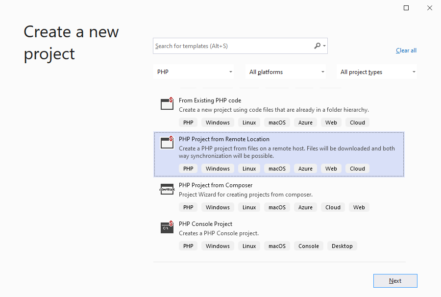
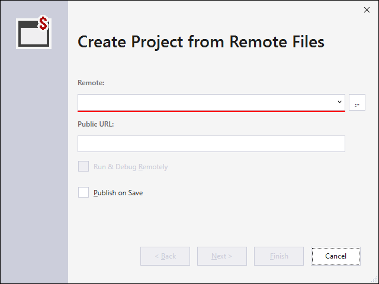

/*
Title: New Project from Remote
Description: Creating new PHP project from existing code on remote machine
*/

# New Project from Remote

In case, the PHP application sources are living on a remote location, such as server, a cloud hosting, or their copy is being maintained in a different directory; the new project may be initialized with a copy of the remote files, and automatically synchronized with them.

The following proces creates a local project initialized with files downloaded from FTP/SFTP/FTPS or copied from a different directory. Created project will be able to automatically sycnhronize the changes between the local files, and the other location.

## Specify the remote host

In the opened wizard, setup the remote connection, and additional options.

- **Remote** - create a new remote profile. This opens a new window where the connection can be specified and verified.
- **Public URL** - optional public URL where the remote web application is exposed. Specifying this option will allow to `Run & Debug Remotely` upon the project creation.
- **Run & Debug Remotely** - checking this option will create the project with remote debugging enabled. Upon running the project, browser will be opened at public URL, and debugger will attempt to connect to the remote machine. This option requires properly setup Xdebug on the remote host. The option can be changed any time later in the Project Properties, under the **Server** tab.

## Synchronization

Upon creating the project, remote files are copied over to the local project. Any local modifications can be uploaded to the remote, or reverted, or new remote files downloaded into the local project any time using [Remote Explorer](remote-explorer).

## Related links

- [Remote Explorer](remote-explorer) - browsing files on remote hosts, downloading remote files, uploading and comparing local changes.
- [New Project](new-project) - creating a new PHP project, either empty or from a template.
- [New Project from Composer Package](new-project-composer) - creating a new PHP project from a composer package.
- [New Project from Existing Code](from-existing-code) - creating a Visual Studio project in an existing location.
