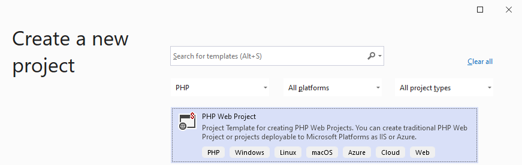
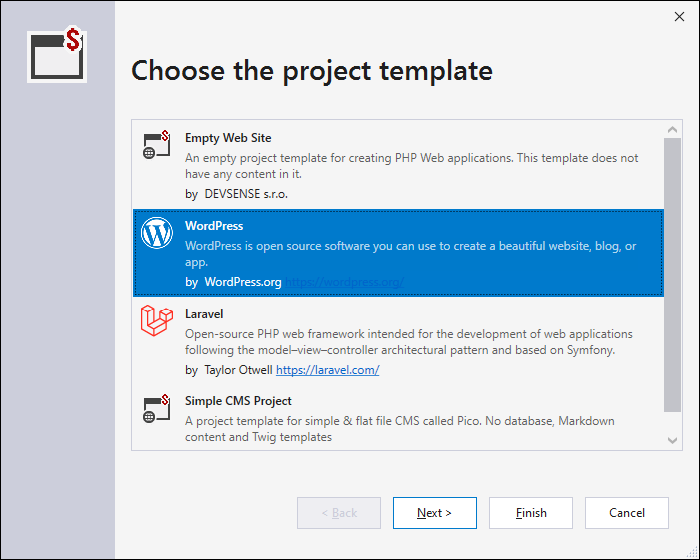
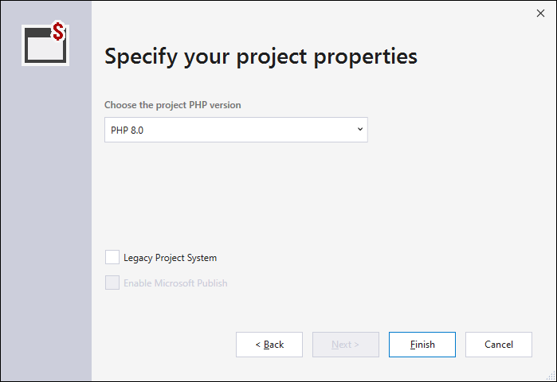
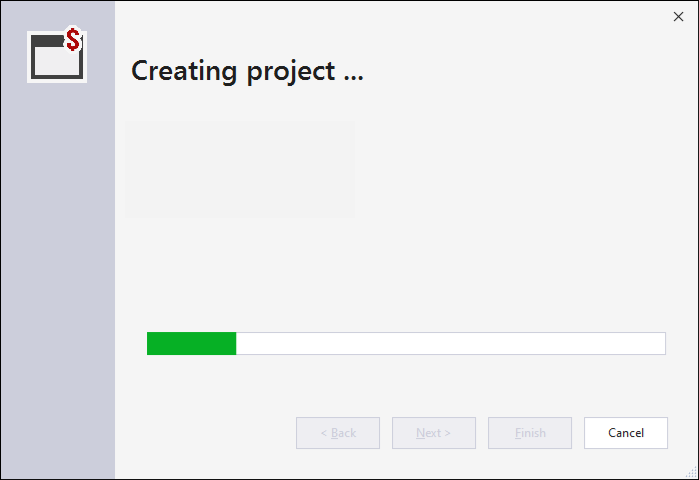

/*
Title: New Project
Description: Creating new PHP project
*/

# New Project

The simplest way of creating a new PHP website is the `PHP Web Project` template in `File` / `New` / `Project` Visual Studio menu.

Upon choosing the template and the new project location, the wizard will provide predefined PHP website templates, and additional options. Finally it downloads and installs PHP itself if necessary, restores composer packages, and ensures the project is ready to run and be debugged.

## Predefined Templates

The wizard comes with pre-defined application templates. Choosing one will initialize the project with the entire empty application.

## Project Properties

The next step provides options to change the default PHP version, that the project will run on, and the type of Visual Studio project. Chosen PHP version gets validated agains the selected pre-defined application template.

- Chosen `PHP` will be installed, if it's not yet installed on the local computer. PHP version can be changed any time later in Project Properties.

- `Legacy Project System` allows to create an older project format compatible with Visual Studio 2010 - 2017. This also enables the `Microsoft Publish` option, which allows to deploy the application using the Visual Studio's Web Project deployment. This includes an Azure deployment target, if it's prefered over the FTP/SFTP option.

## Creating the project files

Upon clicking `Finish`, the project is created and initialized. This may include downloading of additional packages, restoring composer packages, and downloading and configuring PHP itself.

## Related links

- [New Project from Existing Code](from-existing-code.md) - creating a Visual Studio project in an existing location.
- [New Project from Composer Package](new-project-composer.md) - creating a new PHP project from a composer package.
- [New Project from Remote location](new-project-remote.md) - creating a new PHP project that is initialized with files from a remote location, and setups both-way synchronization.
