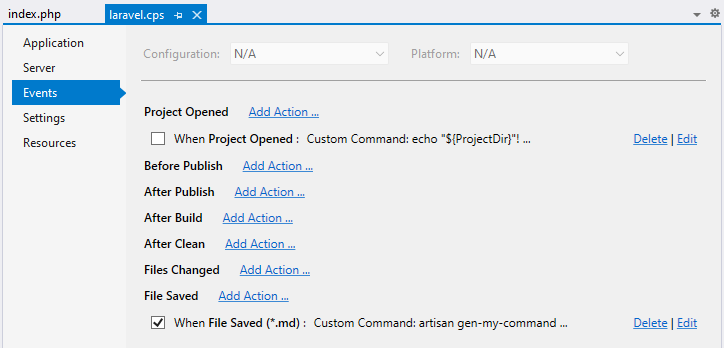

/*
Title: Events
Description: Project Events Configuration
*/

## Project Events

An important part of the project work flow is automatization. **`Events`** project property page allows to customize actions triggered upon certain events. The page can be opened in `Project`/`Properties`:

Initially, there are the following triggers:

- `Project Opened` gets triggered when a project is opened in Visual Studio.
- `Before Publish` is called before publish (i.e. upload pending changes) gets started.
- `After Publish` gets called after the publish.
- `After Clean` is triggered by Project / Clean command.
- `Files Changed` happens when a file is modified both inside or outside Visual Studio.
- `File Saved` is cased by saving a file inside Visual Studio.

And the following actions to choose from:

- `Publish` uploads pending changes using selected remote profile. In case of `File Saved`, only that file is uploaded.
- `Custom Command` allows to enter a custom cmd commands. The commands have `php.exe` (which is chosen in `Application` project property page) in its %PATH% environmental variable.

Creating or editing events looks like the following dialog. The sample below shows the action `Custom Command` triggered upon `Files Changed` event:

## Related Links

- [Automatic Publish](remote-explorer#automatic-upload)