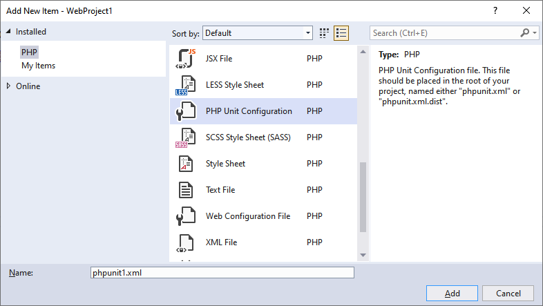

/*
Title: Writing Test Case
Description: How to write a PHPUnit test case.
Version: 1.13 and higher
*/

# Writing Test Case

Test case is a PHP class containing test methods. See [phpunit.de/manual](http://phpunit.de/manual/current/en/writing-tests-for-phpunit.html) for more information about PHPUnit tests.

**Test Explorer** (in the menu `Test / Test Explorer`) lists all the available tests suites by looking in `phpunit.xml` and `phpunit.xml.dist` configuration files in your projects.

By default, the test file name must be placed within `tests` subdirectory, its name suffixed with `Test.php`, and the contained test class name suffixed with `Test`, extending the PHPUnit framework `TestCase` class. All the test methods should be either prefixed with `test` (lowercased) or having a PHPDoc tag `@test`.

The Test Explorer has a delay a few seconds delay (3 seconds) before listing the updated test cases. It should show the following:


> **Note:** script files have to be saved to reflect changes in the Test Explorer window.

## Default Test Case

The following is a default test case class with a single test case function. Usually saved under the `tests/exampletest.php` file:

```php
<?php

class ExampleTest extends \PHPUnit\Framework\TestCase
{
    public function testFunction() {
        $this->assertEquals(2, 1 + 1);
    }
}
```

## Default phpunit.xml

A `phpunit.xml` file is required for the tests to be discovered. You can create a default `phpunit.xml` in the root of the project in the context menu under the project `Add / New Item`, choose category **PHP**, and the item template **PHP Unit Configuration**.



To create the file manually, create an empty file named `phpunit.xml` with the following default content:

```xml
<phpunit
         xmlns:xsi="http://www.w3.org/2001/XMLSchema-instance"
         xsi:noNamespaceSchemaLocation="https://schema.phpunit.de/6.3/phpunit.xsd"
         backupGlobals="true"
         backupStaticAttributes="false">
  <testsuites>
    <testsuite name="My Test Suite">
      <directory>tests</directory>
    </testsuite>
  </testsuites>
</phpunit>
```

The default configuration file defines single test suite "My Test Suite", which includes all the `*Test.php` files within `tests` directory.
