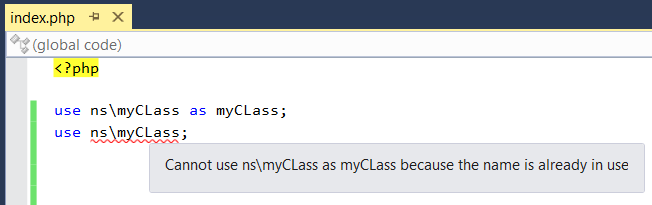
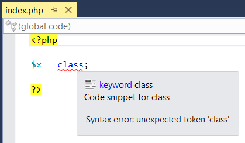

/*
Title: Syntax Validation
Description: PHP syntax validation.
*/

# General Syntax Errors

This first category contains fatal errors, which signal incorrect syntax.
These errors must be fixed before the code can be executed.
Sometimes, these errors may even prevent the editor from analyzing and highlighting the code correctly as they significantly change the meaning of the following code.

These errors can be the most intricate, because they usually require code refactoring.

PHP Tools reports the following errors:

- A syntax error, usually caused by a symbol used in an incorrect context, like in the following sample `$x = class;`.
  - The system reports the unexpected symbol and its position.
- A duplicate use declaration, caused by multiple use declarations defining the same alias.
  - PHP Tools recognizes a conflict even in more complex situations, like in the following sample.
  - Since PHP 5.6, PHP supports functions and constant uses and they are checked for duplicates as well.
  

- The __halt_compiler statement used inside a function or method.
  - The __halt_compiler statement can be used only in the global code (outside any function or method).
- A non-variable used with an increment `++` or decrement operator `--`, like for example `foo($x)++;`.
  - This error can usually be fixed by storing the value in a variable and incrementing it then.
- A mixed namespace declaration style, both namespace notations used in a single file (`namespace ns; ...` and `namespace ns { ... }`).
  - Fixing this error requires that the entire file uses only a single namespace notation.
- An integral constant overflow, value is converted to double, because it is too big for long integer.
  - This error indicates that an integral constant is too big for an integral number and will be stored as double, thus losing precision.
- The parent keyword used in a class that is missing a base class (a class that has no parent class).
  - This error indicates a problem in a class hierarchy, the class is either missing a parent or the parent keyword should be removed.

The following example shows a simple syntax error including the tooltip displayed by PHP Tools. All the syntax errors are highlighted and reported the same way.

