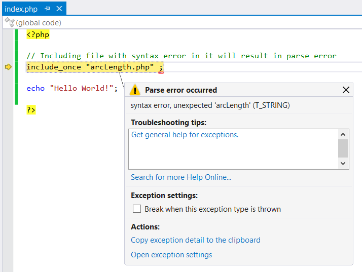
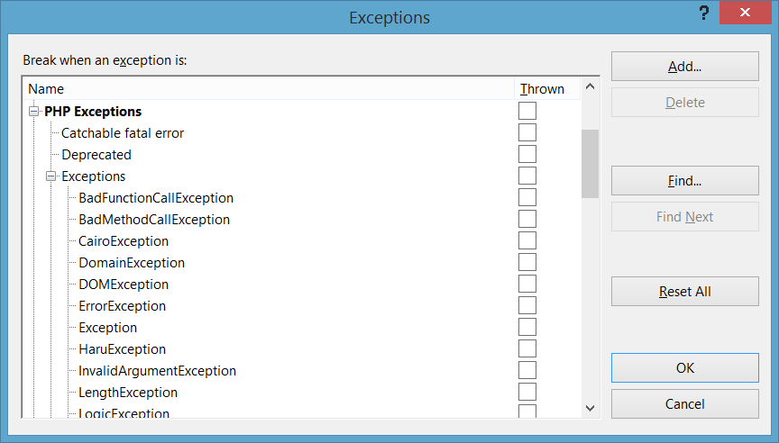

/*
Title: Interrumpir la ejecución cuando se produce una excepción
Description: Break on errors and exceptions when they are raised
*/

# Interrumpir la ejecución cuando se produce una excepción

Si un error fatal ocurre mientras su programa está siendo depurado, PHP Tools detiene la ejecución de manera estándar. Un error fatal es un error que impide que la ejecución del script continúe, como por ejemplo, un error de análisis o una excepción no controlada.

En este caso, el depurador puede ser utilizado para [inspeccionar el estado actual del programa](inspecting-data.md). Si se continúa la ejecución, se seguirá produciendo la excepción hasta que sea controlada o se salga del programa.

Algunos errores fatales (p. ej., una excepción no controlada por el usuario) se producen en la parte del afuera del contexto de ejecución después del que el script ha finalizado. La inspección del estado del programa, en este caso, no funciona porque el script ya no se está ejecutando.

Se puede elegir interrumpir la ejecución inmediatamente cuando se produce una excepción. Estos ajustes se pueden modificar en el cuadro de diálogo “Asistente de excepciones”. En el menú **Depurar**, haga clic en **Excepciones**, y expanda lista de excepciones. Allí podrá ver todas las excepciones conocidas y pueden ser configuradas.

Para configurar una excepción que no aparece en esta lista, haga clic en `Agregar` para añadirla. El nombre debe coincidir exactamente con el nombre de la excepción.

Las casillas de la derecha controlan si el depurador se interrumpe cuando alcanza una de las excepciones. Cada casilla debe marcarse si quiere interrumpir la ejecución más a menudo para una excepción particular.

## Problemas comunes

**El desplazamiento por el código con el depurador funciona, pero no se producen excepciones de PHP en Visual Studio**

Verifique su `php.ini` para `xdebug.default_enable directive` y asegúrese de que está en la posición `1` (éste es el valor predeterminado).
