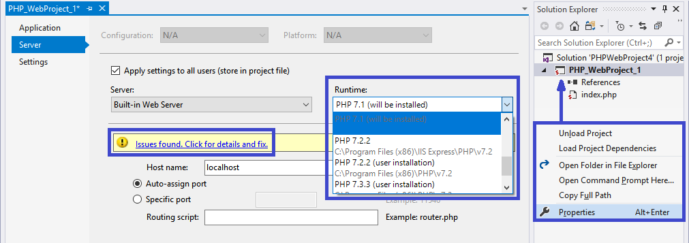
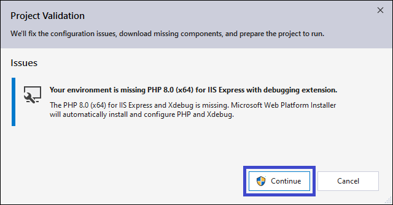
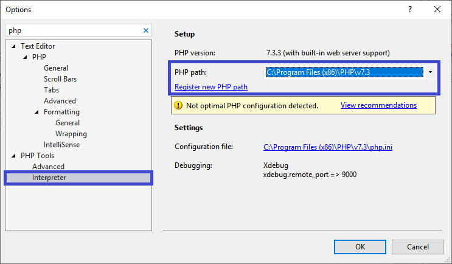
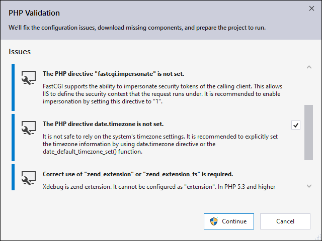
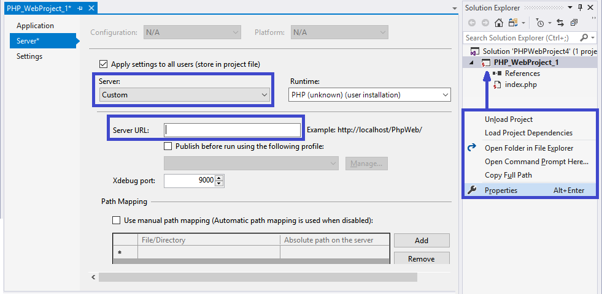

/*
Title: Installing PHP
Description: How to install PHP with PHP Tools for Visual Studio
*/

# Installing PHP with PHP Tools for Visual Studio

PHP is required to run your PHP project locally. Besides, the PHP's `Xdebug` extension is required as well, in order to get the debugging functionality working. 

There are several ways of getting the project ready to run. You can choose depending on the case:

## Select or Install PHP Version

If you don't have PHP installed yet, open or create a `PHP Project` and go to the project's `Properties`. Choose your desired PHP version as depicted below.

Save the properties and proceed to the automatic PHP installation either by running the project (<kbd>F5</kbd>) or by clicking on the warning message `Issues found. Click for details and fix`.

You'll be asked for administrator rights. Then, Microsoft's Web Platform Installer will proceed with the installation of `PHP` already configured with the `Xdebug` extension, which enables the debugging functionality.

## Existing PHP Installation

If you have PHP already installed, but it´s not listed in the project properties (as shown in the first dialog image above), you can configure it to be used by Visual Studio. Go to menu `Tools | Options` and navigate to `PHP Tools / Interpreter` as depicted below.

In the dialog, you can choose a custom directory with `php.exe` program and optionally fix any of its configuration issues.

> **Note 1**: this option may not be able to configure `Xdebug` for you properly.

Then, in order to use the specified PHP version by your actual PHP project, go to project properties and choose your configured PHP directory.

> **Note 2**: PHP Tools will check and analyze the PHP configuration file `php.ini`. The location of `php.ini` is determined in several steps, according to the PHP behavior. If the location is not correct, please check the following:
>
> - The system environment variable `PHPRC` forces PHP to use `php.ini` in a specified location. Removing this environment variable is recommended.
> - PHP looks for `php.ini` in its directory. Ensure the `php.ini` file exists.
> - PHP specifies several other locations, such as system registry. Follow [http://php.net/manual/en/configuration.file.php](http://php.net/manual/en/configuration.file.php) for more information.

## Using a Remote PHP Server

It is possible to run your projects on a remote machine or a virtualized environment, such as a docker container.

Setup your remote machine with your PHP and Xdebug configurations, go to the PHP project properties and choose the custom server as depicted below. Enter the remote machine URL and start your project.

> **Note**: make sure your PHP project gets deployed onto the remote machine upon starting the project, or the project directory is mapped to the remote machine's directory.

## Related Links

- [Configuring Xdebug](../debugging/configuring-xdebug.md)
- [New Project from Existing Code](../project/from-existing-code.md)
