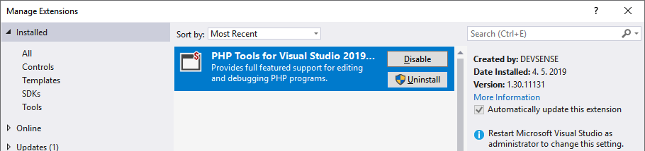
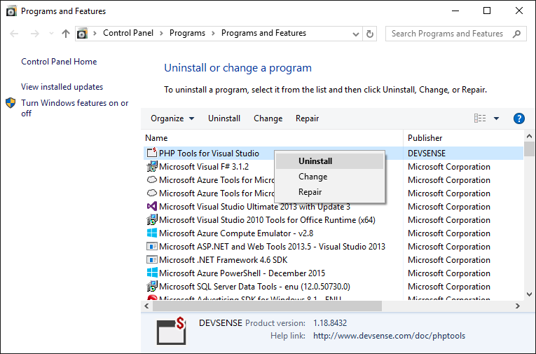

/*
Title: Uninstall
Description: Uninstall PHP Tools for Visual Studio
*/

# Desinstalación

## Visual Studio 2017 o más actual

Ingrese en **Administrar extensiones** en Visual Studio in `Herramientas | Extensiones y actualizaciones` (Visual Studio 2017) or `Extensiones | Administrar Extensiones` (Visual Studio 2019 o más actual).

Haga clic en "Desinstalar".

Cualquier nueva instalación, actualización o eliminación require reininciar Visual Studio. Se recomienda realizar instalaciones o actualizaciones con Visual Studio cerrado.

## Visual Studio 2010 - 2015

PHP Tools for Visual Studio se instala a través de Windows Installer. Utilice **Programas y funciones** en el Panel de control de Windows para reparar, cambiar o desinstalar.

> **Nota**: La extensión se encuentra dentro de `Herramientas| Administar extensiones` sin la opción de desinstalar.
