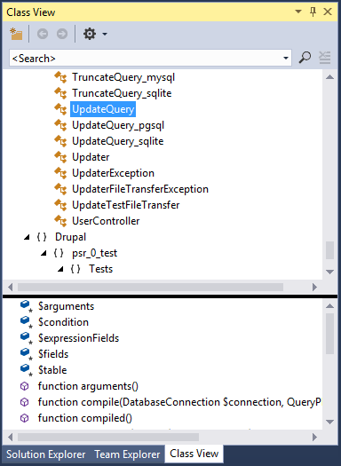

/*
Title: Class View
Description: Using Visual Studio Class View
*/

# Class View

The Class View window aggregates all the PHP classes and interfaces within opened projects. Classes are organized in a tree structure by their namespace and it allows to navigate to their declaration and their members declaration. Classes without a namespace are grouped under the "{Global Namespace}" node.

## Using Class View

The window can be activated in the Visual Studio menu `View | Class View`.

By selecting a class within the window, the lower part of the window displays class members, their signature and glyph.

Double clicking either the class or the member, or pressing <kbd>Enter</kbd> or <kbd>F12</kbd>, navigates the editor to the selected declaration.