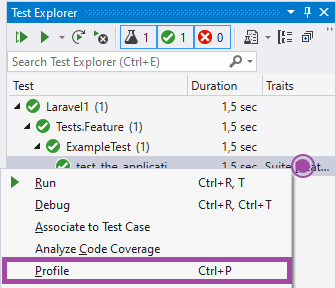

/*
Title: PHPUnit Tests
Description: Profiling PHPUnit tests.
Version: 1.73 and higher
*/

> Applies only for Visual Studio editions with `Test Explorer` functionality.

# Profile PHPUnit Test Case

> Make sure, [requirements](overview.md) are met.

Open `Test Explorer` in `Test` / `Test Explorer`. Then:

- Navigate to the single test case.
- Right click.
- Choose `Profile`.

A new `php.exe` process will start and collects profiling data. After it's finished, [Profiler View](profiler-view.md) will be opened with the results.

> For details about the test run or possible errors, see Visual Studio _Output_ window.

## See also

- [Profiler View](profiler-view.md)
- [Profiling PHPUnit Tests](profiling-phpunit-tests.md)
- [Installing PHP with Xdebug](../installation/install-php.md)
- [Custom Xdebug configuration](../debugging/configuring-xdebug.md)
