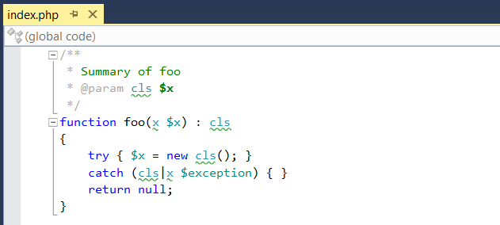
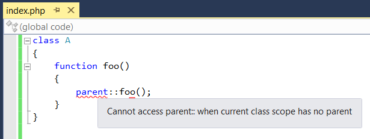
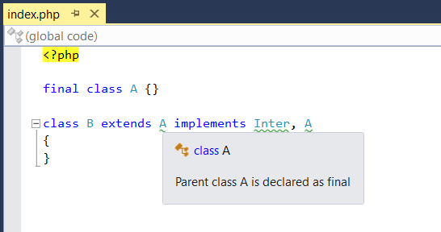

/*
Title: Validación del código
Description: PHP code validation.
*/

# Validación del código

El código es analizado semánticamente para conseguir los errores que aparecerán durante el tiempo de ejecución. El editor realiza análisis de tipo en tiempo lineal en un subproceso en segundo plano, sin bloquear la interfaz del usuario.

El editor utiliza las sugerencias de *PHP 5* y *PHP 7* y los comentarios de *PHPDoc*. Sin tener que especificar la información sobre el tipo, el editor analiza los valores y las expresiones para estimar cuál tipo resultará.

## Estructura del código

### Disparidad de los argumentos de funciones

-	Los argumentos de tipo pasados no coinciden con la definición de parámetros de función especificados en PHPDoc o en las sugerencias de tipo de PHP.
- Argumentos obligatorios ausentes.

### Disparidad entre los valores devueltos

- Las sugerencias de tipo devueltos en PHP 7 y de PHPDoc y los tipos de valores realmente devueltos no coinciden.
- Las sugerencias de tipo de retorno de PHPDoc o de PHP 7 especifican un tipo de retorno, pero una ruta del código no devuelve ningún valor.

### Disparidad de ArrayAccess

- Acceder al valor escalar como array.
- Acceder al objeto sin implementar la interfaz ArrayAccess como array.

### Código no localizable

- La ruta del código no se puede localizar.
- Una ruta condicional no será localizable porque la condición es siempre falsa

### Casos duplicados Switch

- Los casos duplicados son reportados como advertencias.

## Símbolos desconocidos

Los nombres de símbolos desconocidos, sean nombre de clase, nombre de una función, de una constante o del espacio de nombres, son reportados como una advertencia en el código del usuario. Estos errores generalmente indican un error de tipeo, un `use` ausente, o un nombre de espacio no escrito o inválido en los comentarios de PHPDoc.

### Tipos desconocidos

PHP Tools reconoce los tipos desconocidos y da sugerencias que añaden declaraciones de _use_ o nombres propios completamente cualificados para los tipos que son conseguidos en el proyecto, pero no están referenciados apropiadamente. Para más información sobre las sugerencias, vea la página de documentación. Un tipo desconocido es siempre reportado como advertencia en el código. Podemos ver un ejemplo de esto en la siguiente imagen:

Los tipos desconocidos se pueden reconocer en las siguientes situaciones:

- Una clase base desconocida.
- Una interfaz desconocida.
  - Aparte del tipo desconocido, PHP Tools verifica que el tipo implementado sea una interface.
- Un atributo desconocido utilizado en una clase.
- Una sugerencia de tipo desconocido utilizada para una función o un parámetro de método.
- Un tipo desconocido utilizado como una función o un tipo de retorno de método.
- Un tipo desconocido usado en una instrucción catch.
- Un tipo desconocido utilizado en un PHPDoc.

### Funciones desconocidas

PHP Tools reconoce las funciones y métodos desconocidos y reporta su uso como una advertencia en el código. Las funciones desconocidas son reportadas en las siguientes situaciones

- Una llamada a una función (global) desconocida.
- Una llamada a un método desconocido.
- Una llamada a un método estático desconocido.

## Constructores ilegales

Los siguientes errores son sintácticamente válidos, pero fallarán fatalmente una vez que se ejecute el archivo que los contiene.

- El tipo implementado no es una interface
  - Una clase está tratando de implementar un tipo que no es una interface.. 
  - Una clase puede implementar solamente interfaces. Una sola clase puede ser declarada una clase base y sus características son añadidas por una declaración de use.

- La clase base es final.
  - La clase base es determinada como final, lo que significa que no puede ser utilizada como una clase base.

- Utilizar `parent` sin una clase base.

El siguiente ejemplo muestra una jerarquía incorrecta reportada por PHP Tools:

## Tipo palabra clave de PHPDoc 

- Una palabra clave en PHP no existe, pero es similar a algo que sí existe.
