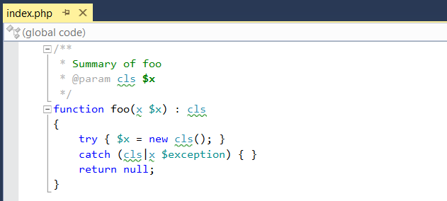
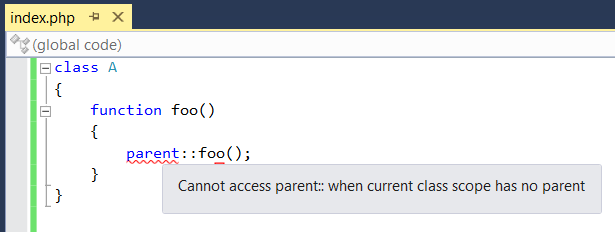
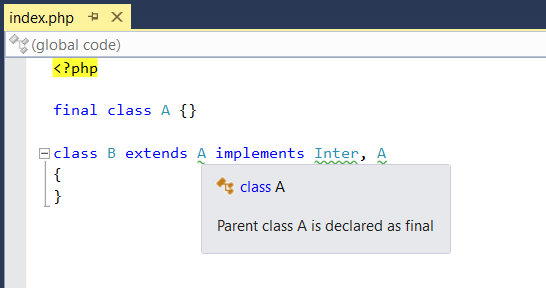

/*
Title: Code Validation
Description: PHP code validation.
*/

# Code Validation

The code is analysed semantically in order to find errors that will be thrown in run time. The editor performs type analysis in linear time on a background thread, not blocking the user's UI.

The editor makes use of *PHP 5* and *PHP 7* type hints and *PHPDoc* comments. Without specifying the type information, the editor analyses values and expressions in order to estimate the resulting type.

## Code Structure

### Function Arguments Mismatch

- passed arguments type mismatch with the function parameters definition specified in PHPDoc or PHP type hints.
- mandatory arguments missing.

### Return Value Mismatch

- PHPDoc, PHP7 return type hint and actual returned values types mismatch.
- PHPDoc or PHP7 return type hint specifies a return type but some code path does not return any value.

### Array Access Mismatch

- accessing scalar value as array.
- accessing object not implementing ArrayAccess interface as array.

### Unreachable Code

- a code path is unreachable.
- a conditional code path will be unreachable because the condition is always false.

### Duplicate Switch Cases

- duplicate cases are reported as warnings.

## Unknown Symbols

Unknown symbol names such as a class name, function name, constant name or a namespace name are reported as a warning in the user's code. 
These errors usually indicate a typo or a missing `use` or an invalid missing namespace name in PHPDoc comment.

### Unknown Types

PHP Tools recognizes unknown types and provides suggestions that add use declarations or proper fully qualified names for types that are found in the project but are not properly referenced. For more information about suggestions see [the documentation page](../editor/suggestions.md).
An unknown type is always reported as a warning in the code. An example of this is in the following image:

Unknown types are recognized in the following situations:

- An unknown base class.
- An unknown interface.
  - Aside from the unknown type, PHP Tools verify that the implemented type is an interface.
- An unknown trait used in a class.
- An unknown type hint used for a function or method parameter.
- An unknown type used as a function or method return type.
- An unknown type used in a catch declaration.
- An unknown type used in a PHPDoc.

### Unknown Functions

PHP Tools recognizes unknown functions and methods and reports their use as a warning in the code.
Unknown functions are reported in the following situations.

- An unknown (global) function is called.
- An unknown method is called.
- An unknown static method is called.

## Illegal Constructs

The following errors are syntactically valid but will fail fatally once a containing file is being executed.

- Implemented type is not an interface
  - A class is trying to implement a type that is not an interface. 
  - A class can implement only interfaces. A single class can be declared as a base class and traits are added by use declarations.

- Base class is final.
  - The base class is declared as final, which means that it cannot be used as a base class.

- Using `parent` without a base class.

The following example shows an incorrect class hierarchy as it is reported by PHP Tools.

## PHPDoc Keyword Type

- a keyword in PHPDoc does not exist but it is similar to something that does

## Intermittent Issues with Array Variables

There are known intermittent issues with array variables that may cause errors such as "property of non-object of type void". These issues may be related to caching or naming.

### Potential Solutions

- Clearing the `/vendor/` cache may help resolve the issue.
- Investigating known issues with `array` variables in the codebase.

For more information, refer to [Error Codes](diagnostics.md) and [Code Validation Details](index.md).
