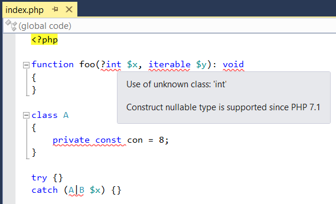
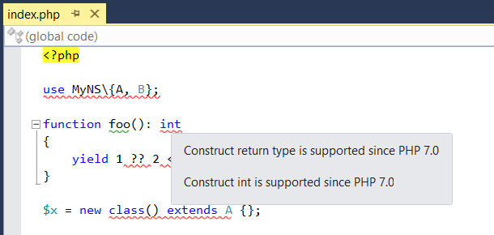
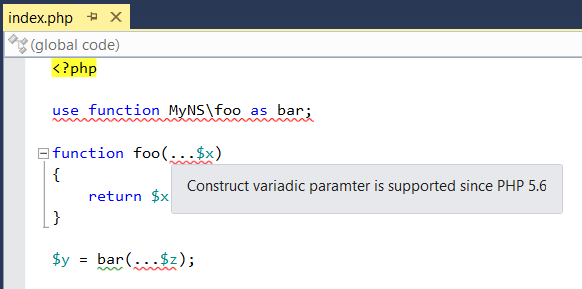
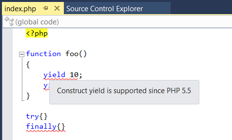
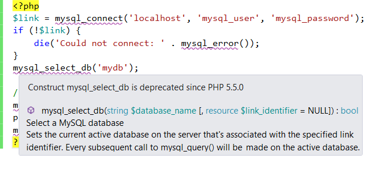

/*
Title: PHP Version Validation
Description: Validation of used constructs against current PHP version.
*/

# PHP Version Validation

PHP Tools reports compatibility issues caused by using features supported in another version of PHP than the one currently used for the project.
These issues are reported as errors, because their usage causes the PHP runtime to crash. 
PHP Tools reports all the issues located in the code, even when multiple errors are caused by a single construct, like in the example for PHP 7.0.

All these errors can be fixed by switching to a newer version of PHP. If that is not possible, it is necessary to refrain from using the new features or the application will crash.

The following sections list some PHP features that are checked against the PHP version selected in the project properties.

## PHP 8.3

- typed class constants
- anonymous readonly classes
- dynamic class constant fetch
- `#[Override]` attribute
- Readonly amendments

## PHP 8.2

- readonly classes
- Disjunctive Normal Form Types
- Constants in traits
- `#[\SensitiveParameter]` attribute
- Fetch properties of enums in const expressions
- Deprecate `${}` string interpolation
- Deprecate partially supported callables
- standalone true,false,null types (https://www.php.net/releases/8.2/en.php#null_false_true_types)

## PHP 8.1
- new octal number syntax
- read-only properties
- `final const`
- new in initializers
- new callable syntax

## PHP 8.0
- `?->` nullsafe operator
- `match`
- non-capturing `catch`
- attributes
- named arguments
- union types in type hints
- `::class` on objects
- `static` return type
- trailing commas in parameter list
- `throw` expression

## PHP 7.4
- arrow function
- array spread
- `??=` operator
- typed properties
- numeric values with '_' separators

## PHP 7.3
- trailing commas
- `instanceof` with literals
- `list()` with references

## PHP 7.2
- `(unset)` cast is deprecated

## PHP 7.1
- Nullable types. A type declared as nullable using the '?' character, for example `function foo(?int $x) {}`.
- Multi-type catch. A catch item declared with multiple exception types separated by the '|' character.
- Class constant visibility modifiers. Class constants declared as `public`, `private` or `protected`.
- Primitive types (`void`, `iterable`).

## PHP 7.0
- The null coalescing operator `??`. The operator is used to access unset or null values.
- The spaceship operator `<=>`. The operator compares two values.
- Anonymous classes. An anonymous class is declared directly in an expression, for example `$x = new class($x) {}`.
- Group use declarations. A group use declaration is used to declare multiple aliases with the same namespace prefix.
- Primitive scalar types (`bool`, `float`, `int`, `string`).
- Return type declarations for functions and methods.
- A generator delegation using the `yield from` call to a generator function, for example `yield from foo();`.
- New classes: `IntlChar`, `Error`.
- New functions: `intdiv`, `preg_replace_callback_array`, `random_bytes`, `random_int`.

## PHP 5.6
- Function and constant use declarations.
- Variadic formal parameters declared using the `...` prefix, for example `function foo(...$x) {}`.
- Unpack actual parameters prefixed by the `...` prefix when a function or method is called, for example `foo(...$x);`.
- The power `**` and power assign `**=` operator.
- Constant expressions used to initialize constants.
- New functions: `hash_equals`, `__debugInfo`.

## PHP 5.5
- Generator functions that use `yield` to return iterable values.
- The `finally` block in an exception handling.
- A list iterated in a `foreach` loop.
- A string literal and array expression dereferencing, for example `$x = "hello"[3];`.

## PHP 5.4 and Older

PHP 5.4 is the oldest version of PHP supported by PHP Tools and its features are always available.

## Deprecated Types and Functions 

PHP Tools reports deprecated types and functions, whenever they are used with newer versions of PHP.
Discontinued types and functions are reported by the previous analyses. Only available but deprecated constructs are reported here.
PHP Tools shows the PHP version where the type or function became deprecated.

