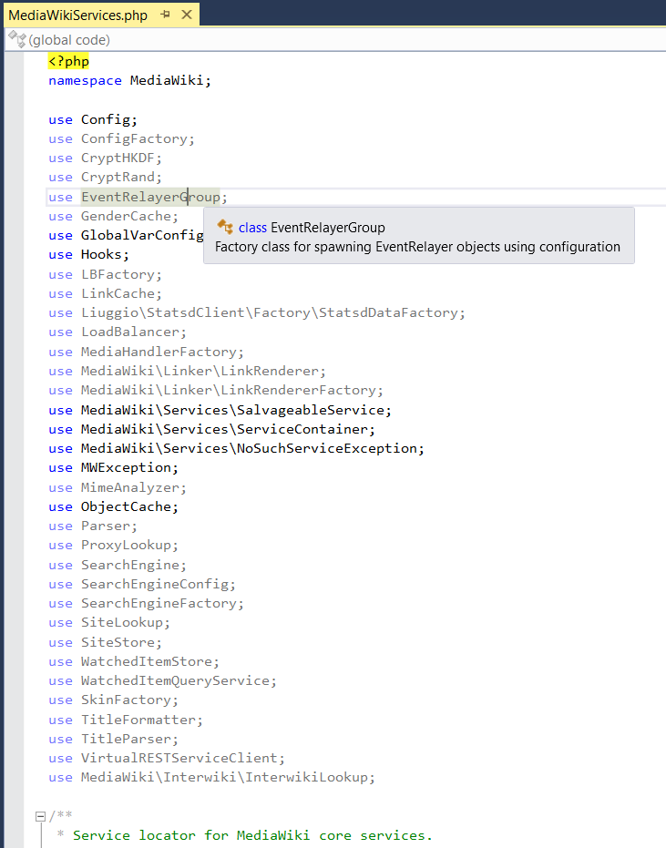
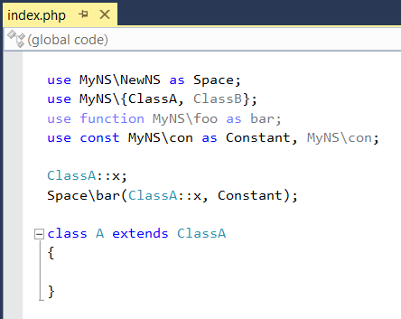
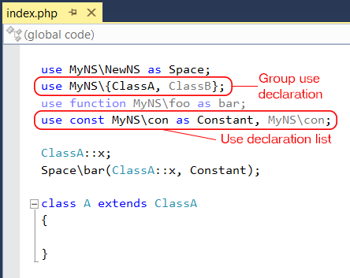

/*
Title: Unnecessary use declarations
Description: Unnecessary use highlighting.
*/

# Unnecessary use declarations

Along with the errors, PHP Tools analyzes the use declarations and report those that are not necessary.
PHP Tools analyzes all the uses and tracks those that are actually used to translate type, function or constant names.
Uses that are declared but not applied are displayed as partially transparent so they can be easily located.
Unnecessary aliases are fully functional; they offer tooltips and navigation. 
PHP Tools analyzes the code continuously and once a use is applied, it is displayed normally as it is no longer unnecessary.

The following example shows a file with multiple unnecessary use declarations.

## Function, constant and group uses

Function and constant aliases, supported since PHP 5.6, are analyzed by PHP Tools as well.
The following file demonstrates the highlighting of use declaration for functions and constants.

Group uses are supported since PHP 7.0 and PHP Tools supports them along with all the other PHP 7.0 features.
All the uses in a group are tracked separately and those that are not necessary are highlighted.
The entire group is reported, but only when all its uses are not necessary.
The following example highlights the functionality: `ClassB` is not used in the code and it is dimmed as the result, but the group is not, because `ClassA` is used.

Lists of uses are treated in the same way as group uses. For example, the list in the last use declaration in the previous example, where the second constant is never used.
