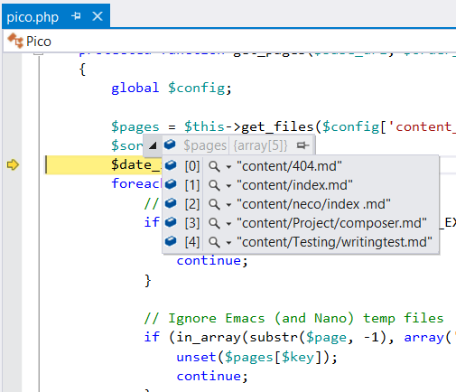
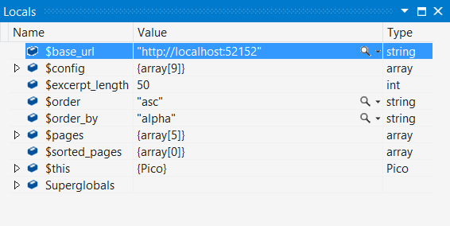
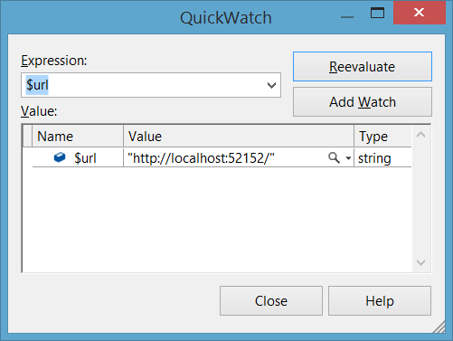

/*
Title: Inspeccionar los datos en el depurador
Description: Inspect variables and evaluate expressions while script is broken in the debugger
*/

# Inspeccionar los datos en el depurador

Mientras el código está siendo analizado por el depurador, se pueden ver los contenidos locales y globales de las variables utilizando **Sugerencias de Datos**, **Ventanas de Inspección** o **Ventana Inmediato**. También es posible cambiar el valor de las variables o evaluar expresiones.

## DataTips: Sugerencias de datos

Para ver un valor utilizado en **Sugerencias de datos**, simplemente coloque el puntero del mouse sobre cualquier variable en el editor.

> **Nota**: Las **Sugerencias de datos** aLas sugerencias de datos son siempre evaluadas en el contexto donde la ejecución se suspende y no donde se encuentra el cursor. Si el cursor está sobre una variable en otra función con el mismo nombre que la variable en el contexto actual, el valor de la variable en la otra función se mostrará como el valor de la variable en el contexto actual.

## Ventana Inspección

Al depurar se pueden examinar y evaluar las variables y las expresiones utilizando la **Ventana Inspección**. También le permite expandir los objetos y array para ver sus miembros al hacer clic en el indicador de expansión `>`.

La **Ventana Inspección** también le permite editar el valor de una variable en la sesión de depuración actual. Si necesita instrucciones, vea [How to: Edit a Value in a Variable Window](https://msdn.microsoft.com/en-us/library/bhawk8xd.aspx).

El formato numérico utilizado en la ventana del depurador puede ser fijado a decimal o hexadecimal al hacer clic con el botón derecho en la Ventana Inspección y luego elegir la opción Vista Hexadecimal en el menú de contexto.

### Ventana Variables Locales

La ventana **Variables locales** (`Depuración | Ventanas | Locales`) contiene todas las variables en el ámbito actual.

En la ventana **Variables locales** siempre se encuentra un ícono de `Superglobales`. Éste es únicamente un ícono de ayuda que contiene todas las variables superglobales: variables internas que están siempre disponibles en todos los ámbitos. Si desea leer más sobre las variables superglobales, consulte el [Manual PHP](http://php.net/manual/es/language.variables.superglobals.php).

### Ventana Automático

La ventana **Automático** (`Depuración | Ventanas | Automático`) muestra las diferentes variables en la instrucción actual y tres instrucciones en cada lado de la instrucción actual.

La instrucción actual es la instrucción en la ubicación de ejecución actual (la instrucción que será ejecutada si la ejecución continua). El depurador identifica estas variables automáticamente, y de ahí viene el nombre de la ventana.

### Ventana Inspección

La ventana **Inspección** (`Depuración | Ventanas | Inspección | Inspección (1,2,3,4)`) le permite escribir expresiones PHP arbitrarias y ver los resultados.

Estas expresiones son reevaluadas para cada paso, a menos que PHP Tools decida que pueden causar algún **efecto secundario**. Un **efecto secundario** ocurre cuando al evaluar una expresión se cambia el valor de los datos en su aplicación. En este caso, la reevaluación de esta expresión es pospuesta y únicamente ocurre cuando es provocada por el usuario.

> **Nota**: Las expresiones siempre son evaluadas en contraste con el marco de pila principal. Por otra parte, si simplemente se está inspeccionando el valor de una variable, el valor se devuelve del actual marco de pila. El marco actual puede ser cambiado en la ventana [Pila de llamadas](callstack.md).

### Ventana Inspección Rápida

La ventana **Inspección rápida** le permite examinar y evaluar las variables y expresiones. La Ventana Inspección rápida es un cuadro de diálogo modal, y debe cerrarse antes de poder continuar depurando.

La ventana **Inspección rápida** puede ser útil cuando se necesita hacer un cálculo rápido que implica una o más variables y no se quiere llenar la Ventana Inspección con esos cálculos. [Ventana Inmediato](#immediate-window).

### Visualizador de cadenas

Cuando un valor que está siendo inspeccionado es una cadena, podrá ver un ícono de lupa en el lado derecho del valor. Al hacer clic sobre éste, se mostrará el valor no cotizado de la cadena en un cuadro de diálogo, el cual contiene ajuste y desplazamiento, y es útil para cadenas largas. Adicionalmente, hacer clic en la flecha que despliega el menú permite seleccionar el modo de visualización que quiere utilizar: texto sin formato, HTML, XML, y JSON.

En modo HTML, una instancia de explorador incrustado se utilizará para representar el código HTML en la cadena. En modo XML and JSON, existe el resaltado de sintaxis pata el marcado correspondiente, y se pueden expandir y colapsar los nodos individuales en el árbol.

## Ventana Inmediato

La ventana **Inmediato** (`Depuración | Ventanas | Immediato`) valora expresiones escritas que son evaluadas en contraste con el marco de pila principal y los resultados se imprimen.

> **Nota**: Cambiar el marco actual en la ventana [Pila del llamadas](callstack.md) solamente afectará las inspecciones de las variables simples; la evaluación de expresiones no funcionará.

