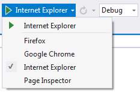

/*
Title: Depurar Javascript
Description: Debug javascript from your PHP project in Visual Studio
Version 1.14 and higher
*/

# Depurar JavaScript

**PHP Tools for Visual Studio** proporciona el entorno para conseguir y corregir errores en páginas PHP en secuencias de comando del lado del cliente.

## Habilitar depuración del script

Antes de poder comenzar a depurar un script con Visual Studio, la depuración del script debe estar habilitada en Internet Explorer. Para más información, vea [How to: Enable and Start Script Debugging from Internet Explorer](http://msdn.microsoft.com/en-us/library/z959x58c.aspx).

## Abrir documentos de script 

Es posible utilizar el **Explorador de Soluciones** de Visual Studio para ver las listas de documentos de script del lado servidor y del lado del cliente.  Cualquier documento de script puede ser abierto desde el **Explorador de Soluciones**. Para más información, vea [Cómo: Ver documentos de script](http://msdn.microsoft.com/es-es/library/bb385621.aspx).

## Asignación de puntos de interrupción

En Visual Studio, no se puede depurar directamente el código del lado servidor, pero se puede establecer un punto de interrupción en un archivo del lado servidor. Visual Studio automáticamente asigna el punto de interrupción en una ubicación correspondiente en el archivo del lado del cliente y crea un punto de interrupción asignado en el código del lado del cliente.

## Comenzar la sesión de depuración

Cuando un proyecto Web PHP es iniciado en modo depuración y el Internet Explorer es utilizado como navegador, PHP Tools adjuntará automáticamente el depurador de script del lado del cliente.

- En VS2010 se utiliza el navegador predeterminado en el sistema 
- En VS2012 y más avanzados, el usuario puede seleccionar el navegador activo desde el modificador del navegador.



## Limitaciones conocidas de la asignación de los puntos de interrupción

Visual Studio permite establecer un punto de interrupción en un script PHP del lado servidor que es transformado en un archivo del lado del cliente durante el tiempo de ejecución. Visual Studio asigna el punto de interrupción del archivo del lado servidor a un punto de interrupción correspondiente en el archivo del lado del cliente, con las siguientes limitaciones:

- Los puntos de interrupción deben ser establecidos dentro de bloques de `<script>`. Los puntos de interrupción en script alineado en bloques `<? ?>` no pueden ser asignados.

- El navegador URL para la página debe contener el nombre de la página. 

- Si se tiene, por ejemplo, http://devsense.com/index.php el punto de interrupción no puede reconocer el redireccionamiento de una dirección como http://devsense.com a la página predeterminada.

- El punto de interrupción debe ser establecido en la página especificada en la URL del navegador, no en otro archivo incluido en esa página. 

- Los puntos de interrupción establecidos en páginas incluidas no pueden ser asignados. Recomendamos situar su código JavaScript en un archivo js separado.

- Los puntos de interrupción establecidos en bloques `<script defer=true>` no pueden ser asignados.

- Para los puntos de interrupción establecidos en bloques `<script id="">` la asignación de los puntos de interrupción ignora el atributo id.

- El punto de interrupción debe ser establecido en la página con la extensión de archivo php.

## Asignación de puntos de interrupción y líneas duplicadas

Para encontrar la ubicación correspondiente en el script del lado del cliente y del lado servidor, el algoritmo de asignación de puntos de interrupción examina el código en cada línea. El algoritmo asume que cada línea es única. Si una o más líneas contienen el mismo código y se establece un punto de interrupción en una de esas líneas duplicadas, el algoritmo de asignación de puntos de interrupción puede seleccionar el duplicado incorrecto en el archivo del lado del cliente. Para evitar esto, añada un comentario en la línea donde se estableció en el punto de interrupción. Por ejemplo:

```js
i++ ;
i ++; // Aquí hay un comentario, por lo tanto esta línea es única
i ++;
```
