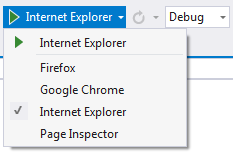

/*
Title: Javascript Debugging
Description: Debug javascript from your PHP project in Visual Studio
Version 1.14 and higher
*/

# JavaScript Debugging

**PHP Tools for Visual Studio** provides a debugging environment for finding and correcting errors in client-side scripts in PHP pages.

## Enabling Script Debugging

Before you are able to begin debugging script with Visual Studio, the script debugging must be enabled in Internet Explorer. For more information, see [How to: Enable and Start Script Debugging from Internet Explorer](http://msdn.microsoft.com/en-us/library/z959x58c.aspx).

## Opening Script Documents

In Visual Studio, you can use the **Solution Explorer** to see the lists of server-side and client-side script documents. Any script document can be opened from the **Solution Explorer**. For more information, see [How to: View Script Documents](http://msdn.microsoft.com/en-us/library/bb385621.aspx).

## Breakpoint mapping

In Visual Studio, you cannot directly debug server-side code, but you can set a breakpoint in a server-side file. Visual Studio automatically maps the breakpoint to a corresponding location in the client-side file and creates a mapped breakpoint in the client-side code.

## Initiating the Debugging Session

When a PHP Web project is launched in debug mode and Internet Explorer is used as browser, PHP Tools will automatically attach the client-side script debugger.

- In VS2010 the system default browser is used. 
- In VS2012 and higher user can choose active browser from browser switcher.



## Known Limitations on Breakpoint Mapping

Visual Studio enables you to set a breakpoint in a server-side PHP script that is transformed to a client-side file at run time. Visual Studio maps the breakpoint from the server-side file to a corresponding breakpoint in the client-side file, subject to the following limitations:

- Breakpoints must be set inside `<script>` blocks. Breakpoints in inline script or `<? ?>` blocks cannot be mapped.

- The browser URL for the page must contain the page name. 

- If you have, for example, http://devsense.com/index.php. Breakpoint mapping cannot recognize a redirection from an address such as http://devsense.com to the default page.

- The breakpoint must be set in the page specified in the browser URL, not in another file included by that page. 

- Breakpoints set in included pages cannot be mapped. We recommend placing your javascript code into a separate js file.

- Breakpoints set in `<script defer=true>` blocks cannot be mapped.

- For breakpoints set in `<script id="">` blocks, breakpoint mapping ignores the id attribute.

- The breakpoint must be set in the page with the php file extension.

## Breakpoint Mapping and duplicate lines

To find the corresponding location in the server-side and client-side script, the breakpoint mapping algorithm examines the code on each line. The algorithm assumes that each line is unique. If two or more lines contain the same code, and you set a breakpoint on one of those duplicate lines, the breakpoint mapping algorithm might select the wrong duplicate in the client-side file. To prevent this, add a comment to the line where you have set the breakpoint. For example:

```js
i++ ;
i ++; // I added a comment, so this line is now unique
i ++;
```

