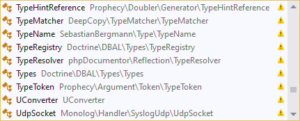
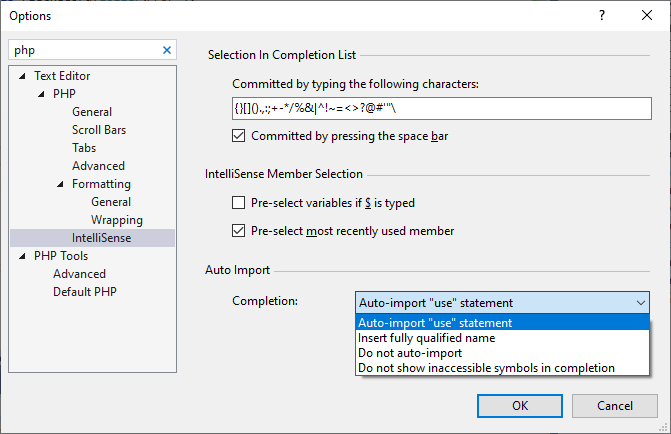

/*
Title: Auto Import
Description: Automatic alias import upon code completion.
*/

# Auto-Import

The [code completion](code-completion.md) UI lists all the symbols available within the project. It contains both the symbols accessible in the current context, and symbols from outside the current namespace.

Depending on the [options](#options), upon completing a type name (class, interface, etc.), a function, or a constant from outside the current namespace, the editor:

- adds the corresponding `use` alias *(default)*. If it conflicts with an existing alias, fully qualified name is inserted instead.
- inserts fully qualified name of the symbol.
- inserts the simple name.
- or it does not list the inaccessible symbols at all.

Symbols, that will be auto-imported are marked with the yellow exclamation mark icon.

## Options

The beahvior is configured in the Visual Studio Options dialog, as depicted below. The Options dialog can be opened in the menu `Tools` / `Options`.

## Related links

- [Code Completion](code-completion.md)
- [Code Suggestions](suggestions.md)
