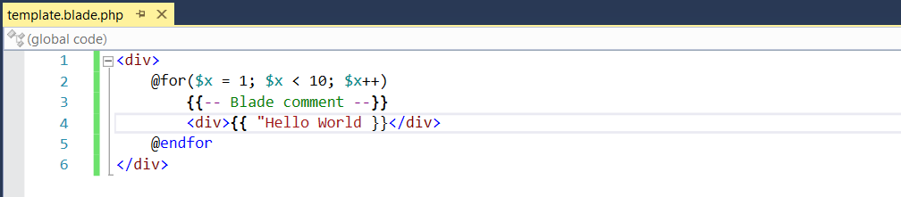
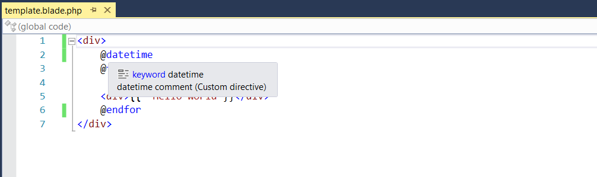
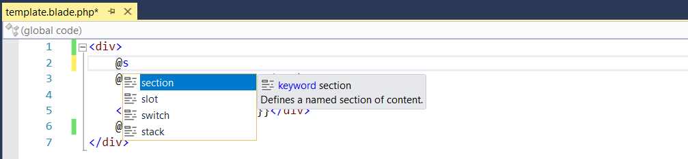
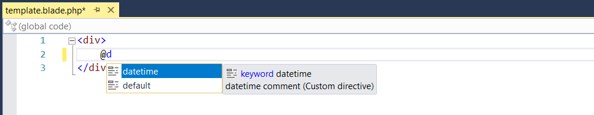

/*
Title: Blade
Description: Blade templates support.
*/

# Blade Support

Blade templates are an integral part of Laravel framework. PHP Tools natively supports Blade templates since version 1.28 in Visual Studio 2015 and newer.
PHP Tools provides IntelliSense and navigation for Blade templates. The following sections provide detailed information on all the available features.
Blade support is fully built-in and its features do not require Blade or Laravel to be installed in the project.

## Syntax Highlighting

PHP Tools provides comprehensive syntax highlighting for Blade templates.
The colors follow the Visual studio color scheme and support VS themes.

<i>This image shows highlighted Blade syntax for a short template.</i>

## Tooltips

PHP Tools provides tooltips for all known directives, variables and functions (both user defined and intrinsic).
PHP Tools provide basic tooltip for all constructs and additional information is provided for user-defined directives declared with PHPDoc documentation.
PHP Tools provide tooltip support for the following constructs: 
- Built-in directives.
- User-defined directives. 
- PHP variables and functions used in the <code>{{ }}</code> statement.

<i>This image shows an example of a tooltip for user-defined directive <code>datetime</code>, including its PHPDoc comment.</i>

## IntelliSense Completion

PHP Tools provides Intellisense completion assistance that provides available directives, functions and variables.
The matching completion list is displayed either when the user starts typing a new word or when the completion is directly activated by the `Complete Word` command (<kdb>Ctrl+Space</kdb>).
The completion supports the following features:
- Built-in directives.
- User-defined directives. 
- PHP variables and functions used in the `{{ }}` statement.

<i>The example image shows the completion options for the text <code>@s</code> with the built-in directive <code>section</code> selected as the best match.</i>

## Navigation

PHP Tools supports the `Go To Definition` command (<kdb>F12</kdb>) for all user-defined directives and PHP variables and functions.
The command opens the file containing the definition of currently selected variable or directive and places the caret the beginning of the definition.
The navigation supports the following features:
- User-defined directives. 
- PHP variables and functions used in the `{{ }}` statement.

<i>The example shows the command in a context menu for the <code>datetime</code> directive.</i>

## User Extension Support

PHP Tools supports all the user extensions allowed by the Blade engine.
User extensions are supported through all the features, including Intellisense and navigation.
PHP Tools supports the following features:
- Blade component aliased using the `component` method (`Blade::component('components.alert', 'alert')`). 
- User-defined directives (`Blade::directive('test', "test_function")`). 
- Custom if statements (`Blade::if('env', function ($environment) { return true; })`). 

<i>Example of a completion list displaying a user-defined directive `datetime`.</i>

## Blade Installation

Blade can be installed via a composer package.
Blade is available as part of the official package containing the Laravel framework or in independently-made packages containing just Blade.

## Blade Limitations

PHP Tools supports Blade integration with HTML in Visual Studio 2015 and newer. Integration with Cascading Style Sheets (CSS), JavaScript and TypeScript is currently not supported.
