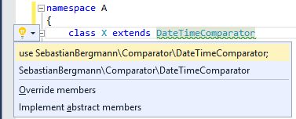

/*
Title: Finalización de código
Description: Using of IntelliSense Code Completion.
*/

# Finalización de código

La finalización de código (o autocompletar) es una función que predice qué puede ser escrito en un lugar específico en un contexto específico. Generalmente muestra una lista de sugerencias, pre-selecciona la mejor y automáticamente completa la palabra cuando es posible.

La función aprende del usuario del código, integra el manual PHP, realiza análisis de tipo y provee sugerencias basadas en toda esa información.

## Activar la finalización de código

La lista de finalización de código se activa automáticamente cuando el usuario escribe, y también puede ser forzada por un atajo del teclado. Dicha lista aparece después de los símbolos que la activan, si aplica:

- Cuando el usuario escribe la primera letra de una palabra.
- Después de `->`, `\`, `::`, `$`.
- Después de `use`, `extends`, `implements`, `global`, `instanceof`, `new`, `function`.
- Después de `@` dentro de PHPDoc.

Una vez que la lista se activa, las siguientes teclas que el usuario presiona filtran la lista hacia las correspondencias más cercanas. La lista puede cerrarse al presionar la tecla <kbd>Esc</kbd>.

La lista de finalización puede ser abierta nuevamente con el atajo  <kbd>Ctrl+Space</kbd> o <kbd>Alt+Right Arrow</kbd>. Si hay una sola sugerencia, ésta se inserta inmediatamente en el texto sin mostrar la lista.

### Finalizar los nombres de las variables

Ya que PHP no tiene instrucción de declaración de variable, el editor de PHP no puede finalizar los nombres de las variables automáticamente mientras el usuario escribe, ya que esto causaría finalizaciones falsas frecuentes cuando el usuario quiere escribir el nombre de una variable nueva.

Esto es manejado por el editor de PHP de diferentes maneras. Este comportamiento se puede cambiar en `Herramientas | Opciones | Editor de texto | PHP | IntelliSense`, al activar la opción `Pre-seleccionar variables si se escribe '$'`.

- Si una palabra que se está escribiendo comienza con `$`, ésta es tratada como una nueva variable, y la lista de definición no preselecciona ningún miembro.
- Si una palabra que se está escribiendo no comienza con `$`, y la palabra coincide con una variable de la lista, la variable es preseleccionada. Si hay otros objetos que corresponden mejor con la palabra, se le da prioridad si el nombre corresponde completamente con la palabra escrita.

### Finalizar miembros de objeto

Después de `->` la finalización de código sugiere todos los miembros de objeto diponibles. Esta función trabaja únicamente si el tipo de expresión antes de `->` está correctamente determinada por el editor.

### Finalizar miembro de objeto

Nombres de tipo posibles (clases, interfaces y atributos) se enumeran en la lista de finalización mientras el usuario escribe. Si el signo de intercalación se encuentra después de una palabra clave de contexto como `new`, `extends`, `implements`, `instanceof` y otras, solamente tipos significativos son sugeridos.

Los nombres enumerados se filtran por contexto de espacio de nombres actual. Cuando el nombre de tipo sugerido es parte espacio de nombre y parte nombre (por ejemplo, `A\B\C`), sus partes son sugeridas subsecuentemente después de escribir el símbolo `\`.

En el caso en que un usuario escriba un nombre de tipo que no se encuentre visible en el contexto actual del espacio de nombres, el editor los marca con un signo de exclamación.

Si un tipo inaccesible así es utilizado en un código, el editor proporciona sugerencias adicionales que insertan automáticamente `use`, o expanden el nombre a un nombre completamente calificado, o cambian el nombre a su forma más corta utilizando los alias existentes. Para más información acerca de las sugerencias, vea [la página de documentación](suggestions.md).

#### Mejorar la finalización

El finalizado del código está basado considerablemente en el comportamiento del usuario. Para mejorar su finalizado de código después de`->`, asegúrese de que el editor puede determinar el tipo de expresión antes. Puede verificar el tipo de variables en un lugar específico colocando el cursor por encima de ellas y verificando su información sobre herramientas. Si el tipo no está determinado correctamente por el editor o muestra únicamente `mixed` o `object`, comentarios adicionales PHPDoc pueden ser provistos para mejorar la finalización.

PHPDoc puede estar ubicado por encima de las funciones para proporcionar ideas de tipo para los parámetros de función (al usar la etiqueta `@param`) y el tipo de retorno de función (al usar la etiqueta `@return`). Además, puede escribir bloques PHPDoc directamente en el código especificando tipos de variable (como por ejemplo `/** @var MyClass $x */`).

### Finalizar Array Keys

> **Nota**: Intellisense para Array key no es compatible aún.

## Confirmar la finalizacion de código

Una vez que la lista de finalización se abre, hay símbolos específicos que confirman la finalización desde el objeto activamente seleccionado de la lista. Además de los símbolos especificados en el menú `Herramientas | Opciones | Editor de texto | PHP | IntelliSense`, hay algunas otras teclas que se pueden utilizar para confirmar:

- <kbd>Enter</kbd> y <kbd>Tab</kbd> confirman el objeto seleccionado.
- <kbd>Space</kbd> confirma el elemento seleccionado si se especifica en las opciones más arriba y además inserta un espacio después del cursor del teclado
- `\`, `[`, `(` y `;` confirman el objeto seleccionado e insertan el símbolo.

> **Nota**: inmediatamente después de una palabra clave compatible con un fragmento de código  (por ejemplo, `for`, `class`, `if` o `try`), la tecla <kbd>Tab</kbd> inserta el fragmento entero de código que corresponde a esa palabra clave.

## Seleccionar miembro reciente

La lista de finalización recuerda los elementos confirmados recientemente en un contexto específico. Los elementos que tienen mayor coincidencia y fueron utilizados recientemente son preseleccionados la próxima vez que la lista de finalización es desencadenada, ya que aprende de los usos recientes.

La función puede desactivarse en el menú `Herramientas | Opciones | Editor de texto | PHP | IntelliSense`.
