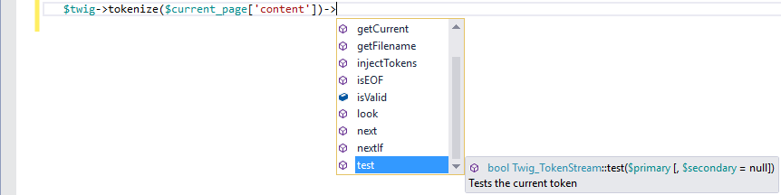
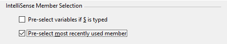
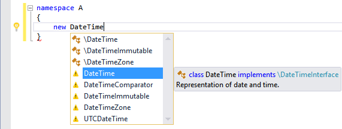
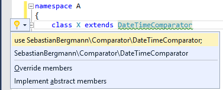

/*
Title: Code Completion
Description: Using of IntelliSense Code Completion.
*/

# Code Completion

The code completion (or word completion) is a feature that predicts what can be typed in a specific place in a specific context. It usually displays a list of suggestions, pre-selects the best one and automatically completes the word when possible.

The feature learns from user's code, integrates PHP manual, performs type analysis and provides suggestions based on all this information.

## Triggering Completion

The completion list is triggered automatically as the user types, or it can be forced by a keyboard shortcut. The list pops up after several triggering tokens, if the completion list is applicable:

- when user types the first letter of a word
- after `->`, `\`, `::`, `$`
- after `use`, `extends`, `implements`, `global`, `instanceof`, `new`, `function`
- after `@` within PHPDoc

Once the list is triggered, the user's subsequent typing filters the list to the closest matches. The list can be closed by pressing the <kbd>Esc</kbd> key.

The completion list can be opened again with the keyboard shortcut <kbd>Ctrl+Space</kbd> or <kbd>Alt+Right Arrow</kbd>. If there is only a single unique suggestion, it is inserted into the text immediately without showing the completion list.

### Completing Variable Names

Since PHP does not have a variable declaration statement, the PHP Editor cannot complete variables automatically as the user types. Otherwise it would cause frequent false completions when user wants to type a new variable name.

This is handled by the PHP Editor in several ways. This behavior can be changed in `Tools | Options | Text Editor | PHP | IntelliSense`, by ticking the option `Pre-select variables if '$' is typed`.

- If a typed word starts with `$`, it is treated as a new variable, and the completion list does not pre-select any member.
- If a typed word does not start with `$`, and the word matches a variable from the list, the variable is pre-selected. If there are better items matching the word, the variable is prioritized if its name fully matches the typed word.

### Completing Object Members

After `->` code completion suggests available object members. This feature works only if the type of the expression before `->` is correctly determined by the editor.

### Completing Type Names

Possible type names (classes, interfaces and traits) are listed in the completion list as user types. In case the caret is after a context keyword like `new`, `extends`, `implements`, `instanceof` and others, only meaningful types are suggested.

Listed names are filtered for current namespace context. When the suggested type name consists of a namespace part and a name part (e.g. `A\B\C`), its parts are suggested subsequently after typing the `\` character.

In case the user writes a name of a type that is not visible in the current namespace context, the editor marks such type with an exclamation mark. 

If such inaccessible type is used in a code, the editor provides additional suggestions that automatically inserts `use`, or expands the name to a fully qualified name, or expands the name to its shortest form using existing aliases. For more information about suggestions see [the documentation page](suggestions.md).

### Improving Completion

Code completion is heavily based on type analysis and cleannes of the code. To improve code completion after `->`, make sure the editor can resolve type of the expression before. You can check the type of variables at a specific place by hovering the mouse over it and checking its tooltip. If the type is not resolved by the editor correctly, or displays only `mixed` or `object`, additional [PHPDoc comments](phpdoc.md) may be provided to improve the completion.

[PHPDoc](phpdoc.md) can be placed above functions to provide type hints for function parameters (using `@param` tag) and function return type (using `@return` tag). Additionally, you can write PHPDoc blocks right in the code specifying variable types (e.g. `/** @var MyClass $x */`).

There are numerous of PHPDoc tags and specialized type notations. See [PHPDoc](phpdoc.md) for more details.

### Completing Array Keys

> **Note**: Array key IntelliSense is not supported yet.

## Committing Code Completion

Once the completion list is opened, there are specific characters that commit the completion from the actively selected item in the list. In addition to characters specified in menu `Tools | Options | Text Editor | PHP | IntelliSense`, there are some following commit keys:

- <kbd>Enter</kbd> and <kbd>Tab</kbd> commit the selected item.
- <kbd>Space</kbd> commits the selected item if specified in options above, and inserts space after the keyboard cursor.
- `\`, `[`, `(` and `;` commit the selected item and inserts the character.

> **Note**: Right after a keyword supporting snippets (e.g. `for`, `class`, `if` or `try`), <kbd>Tab</kbd> key inserts the whole code snippet corresponding to the keyword.

## Recent Member Select

The completion list remembers recently committed items in a specific context. By learning from these recent usages of the completion list, next time the completion is triggered, the best matching recently used item is pre-selected.

The feature can be disabled in menu `Tools | Options | Text Editor | PHP | IntelliSense`.

## See Also

- [Auto-Import](auto-import.md)
- [PHPDoc Comments](phpdoc.md)
