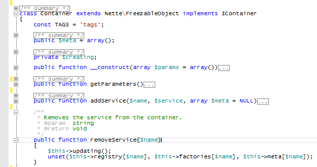
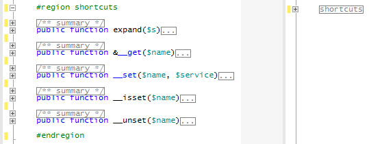

/*
Title: Esquematizacion
Description: Using outlining in PHP scripts.
*/

# Esquematización

El editor PHP le permite minimizar el contenido de las funciones, clases, espacios de nombres y PHPDoc para tener una mejor vista de su código.

Además, cuando el Editor PHP consigue un error sintáctico o un error lógico, la expresión correspondiente se subraya con una línea roja ondulada y los detalles del error se enumeran en la ventana Lista de errores.

## Atajos predeterminados

- <kbd>Ctrl+M, O</kbd> - Contrae todos los bloques a definiciones.
- <kbd>Ctrl+M, P</kbd> - Detiene la esquematización.
- <kbd>Ctrl+M, M</kbd> - Alterna la esquematización.
- <kbd>Ctrl+M, L</kbd> - Alterna toda la esquematización.

## Región contraíble

La siguiente lista describe todos los fragmentos de código que permiten esquematización:

- Cuerpo de clase
- Contenido del espacio de nombres
- Cuerpo de función
- Funciones Lambda
- Bloque de comentarios PHPDoc
- Comentarios en líneas múltiples
- Grupo de comentarios de líneas únicas
- Etiquetas de script PHP que contienen más de una línea de código
- Contenido PHP entre `#region`/`#endregion` o `//region`/`//endregion`
- Bloques de código delimitados por `{ ... }` *(desde la versión 1.18)*
- Contenido de `switch`, `case` y `default` *(desde la versión 1.18)*
- Código delimitado por `for`, `foreach`, `if`, `else`, `elseif` *(desde la versión 1.18)*

El comportamiento de la esquematización puede ser modificado en las opciones de lenguaje de PHP. Para desactivar la esquematización automática de un archivo abierto recientemente, o para cambiar las opciones de esquematización adicional, ingrese en `Herramientas | Opciones | Editor de texto | PHP | Avanzado`.

## Esquematización de &#35;region

Los comentarios de una sola línea que comienzan con la palabra clave  `region` se tratan como el inicio de una región colapsable, y son emparejados con un comentario `endregion` al final. Las regiones pueden ser anidadas. Alternativamente, el usuario puede especificar el nombre de la región después de la palabra clave `region`.
