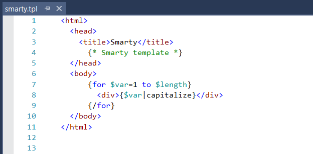
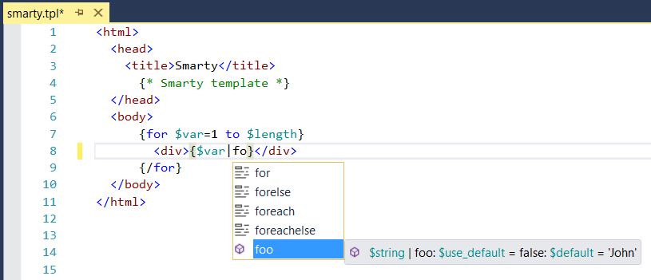
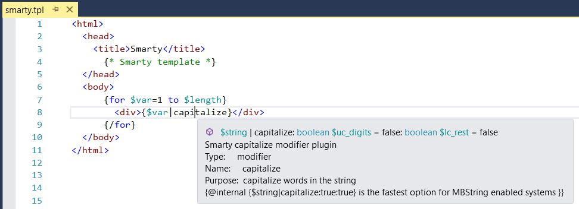
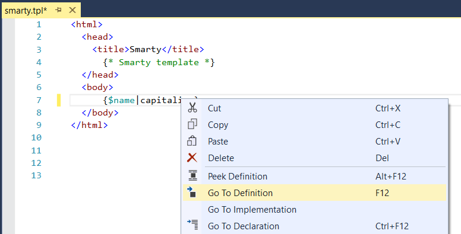
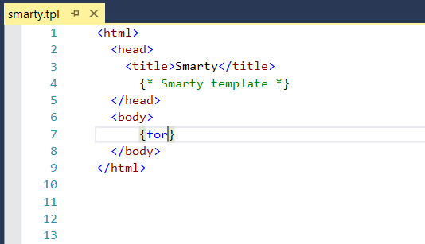
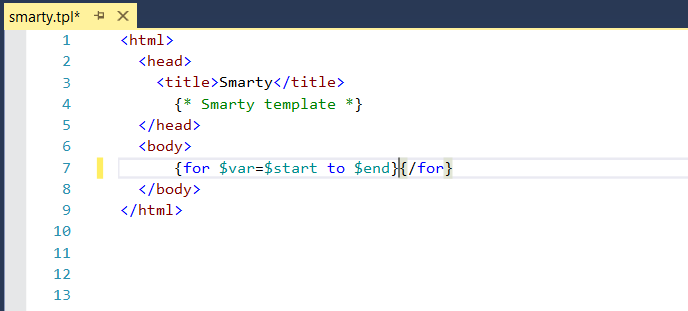
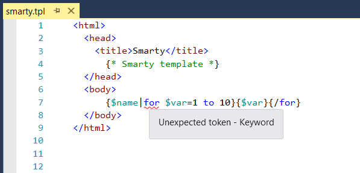
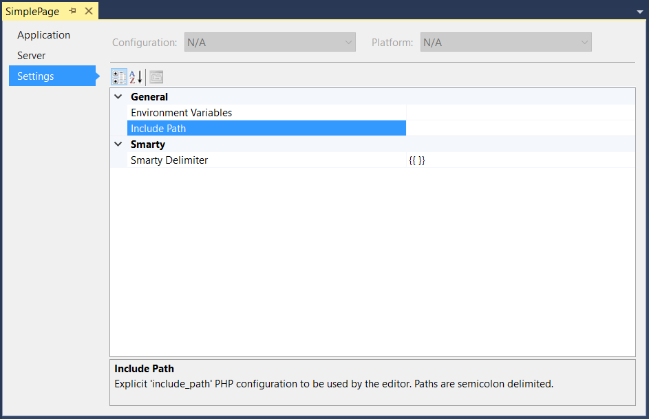

/*
Title: Smarty
Description: Smarty template engine support.
*/

# Smarty Support

PHP Tools natively supports the Smarty template engine since version 1.22 in Visual studio 2015 and newer.
PHP Tools provides many tools for Smarty, such as intellisense and navigation. The following sections provide detailed information on all the available features.
The Smarty support is built-in and its features do not require Smarty to be installed in the project (detailed information is provided for each feature).
Smarty can be installed either via a composer package or its source code can be directly integrated into the project.

## Syntax Highlighting

PHP Tools provides comprehensive syntax highlighting for Smarty templates.
The colors follow the Visual studio color scheme and support VS themes.
Syntax highlighting does not require Smarty to be installed. 

<i>This image shows highlighted Smarty syntax for a short template.</i>

## User Extension Support

PHP Tools supports the smarty engine itself and all the user extensions and definitions allowed by the engine.
User extensions are supported through all the features, including intellisense, navigation and syntax validation.
PHP Tools supports the following features:
- User defined modifiers and filters (PHP functions with the name prefixed `smarty_modifier_`). 
- Variables defined in PHP (defined in PHP code using `Smarty->assign('name, 'value');`). 

<i>Example of the intellisense for a user defined Smarty modifier.</i>

<i>Smarty variable defined by the user in a PHP code and used in a template.</i>

## Tooltips

PHP Tools provides tooltips for all known variables and modifiers or filters (both user defined and intrinsic).
The tooltips for modifiers follow the Smarty notation (`$string|capitalize:true:true`).
PHP Tools provide basic tooltip for all constructs (signature and default values) and additional information is provided for modifiers declared with PHPDoc documentation.
PHP Tools provide tooltip support for the following constructs: 
- Built-in modifiers and filters (requires Smarty to be installed).
- User defined modifiers and filters (declaration must be part of the project). 
- Variables defined in PHP (`Smarty->assign('name, 'value');`).
- Variables used in Smarty template (variables used in the currently edited template).

<i>This image shows an example of a tooltip for built-in modifier <code>capitalize</code>, including its PHPDoc documentation.</i>

## IntelliSense Completion

PHP Tools provides intellisense completion assistance that provides available functions, variables and keywords.
The matching completion list is displayed either when the user starts typing a new word or when the completion is directly activated by the `Complete Word` command (<kdb>Ctrl+Space</kdb>).
The completion supports the following features:
- Built-in modifiers and filters (requires Smarty to be installed).
- User defined modifiers and filters. 
- Variables defined in PHP (`Smarty->assign('name, 'value');`).
- Variables used in Smarty template (variables used in the currently edited template).
- Smarty keywords (including multi-word like `is even`).

<i>The example image shows the completion options for the word <code>capi</code> with the built-in modifier <code>capitalize</code> selected as best match.</i>

## Navigation

PHP Tools supports the `Go To Definition` command (<kdb>F12</kdb>) for all constructs defined either by the user or directly in Smarty.
The command opens the file containing the definition of currently selected variable or modifier and places the caret the beginning of the definition.
The navigation supports the following features:
- Built-in modifiers and filters (requires Smarty to be installed).
- User defined modifiers and filters. 
- Variables defined in PHP (`Smarty->assign('name, 'value');`).

<i>The example shows the command in a context menu for the <code>capitalize</code> modifier.</i>

## Construct Completion

PHP Tools provides a command similar to `Insert Snippet` (<kdb>Tab</kdb>) for pair Smarty tags like `for` or `php`.
The command is activated by pressing <kdb>Tab</kdb> when the caret is placed at the end of a pair keyword.
When used for a pair tag, PHP Tools adds the end tag (for example `{/for}`) and standard parameters supported by the construct, like initial values or limits.
PHP Tools supports all the pair tags.

<i>The following images show the completion of a <code>for</code> loop pair tag:</i>

<i>This first image shows the initial code.</i>

<i>This second image shows the completed <code>for</code> loop.</i>

## Syntax Validation

PHP Tools provides simplified syntax validation for Smarty templates.
The system checks basic Smarty syntax rules, but it does not analyze more complex constructs, like modifier signature (parameters).  
The validation is not completely strict to provide more freedom for customization of the Smarty engine, while providing information for the common errors.

<i>The image shows a syntax error where the <code>for</code> tag is used as a filter.</i>

## Smarty Installation

Smarty can be installed either via a composer package or its source code can be directly integrated into the project (by copying its code).
PHP Tools provides an information bar whenever a template is opened without the Smarty system installed. The bar is shown in the following image.
It allows users to seamlessly install the Smarty composer package, simply by clicking on the Install now link. 
The bar disappears once Smarty is installed. The bar can be closed either once or forever by clicking the appropriate button.

## Smarty Properties

PHP Tools supports global Smarty settings, which modify how the editor works with Smarty.
The settings are defined in a project file and can be changed either in the project Properties GUI page or in the project source code (`XML`).
Smarty settings can be accessed by right clicking the project file and selecting Properties. The settings are in the table in the last section titled Settings.
The settings are not available when Smarty system is not installed, which is reported by the information bar explained in the previous section. 
PHP Tools supports the following features:
- Smarty delimiters (parentheses surrounding Smarty tags), delimiters can be changed for each project to prevent conflicts with other languages (for example JavaScript).
  - The delimiters are set using the `SmartyDelimiter` property using the string `"left right"` where the space is necessary.

<i>This image shows the Smarty settings in the project Properties page.</i>

<i>This example shows the Smarty delimiters changed in a project file.</i>

## Smarty Limitations

PHP Tools supports Smarty integration with HTML, Cascading Style Sheets (CSS), JavaScript and TypeScript in Visual studio 2015 and newer.
