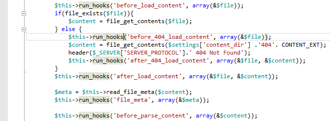

/*
Title: Word Highlighting
Description: Contextual highlighting of occurances of a symbol.
Version: 1.15 and higher
*/

# Word Highlighting

PHP editor emphasizes occurrences of a symbol which has the keyboard cursor in (also known as _semantic token highlighting_). This feature performs full contextual match, it means not only words with the same content are highlighted, but the highlighted word must refer to the exact same symbol in actual context.

## Using Word Highlighting

By navigating the keyboard cursor over a symbol, waiting for about 500ms, the symbol occurrences are highlighted.

This feature is used to quickly check occurrences of a symbol under the keyboard cursor within the editor window. Usually it is used to visually check where is e.g. a local variable used.

> **Note**: The feature supports the same matches as [Find All References](../navigation/shift-f12-findallref.md).

## See also

- [Syntax Highlighting](syntax-highlighting.md)
