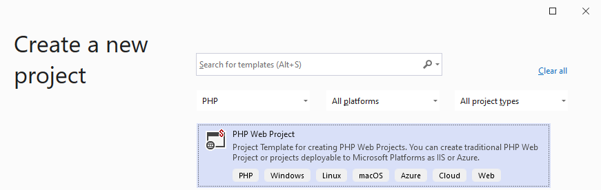

/*
Title: Getting Started
Description: PHP Tools for Visual Studio, first steps
*/

# Getting Started with PHP Tools

Welcome to full PHP support in Visual Studio! This guide will help you get started with PHP development using the PHP Tools extension. Follow these steps to set up your project, configure PHP, and start running and debugging your applications.

## Create a PHP Project

Visual Studio works with project files to organize and configure your PHP workspace. To create a new PHP project, follow these steps:

1. Open Visual Studio.
2. Create a new project by selecting **Create a new project** at startup srceen or navigating to **File** → **New Project**.
3. Filter project types to show only **PHP** projects.

    

4. Choose from the available options:
   - **PHP Project From Existing Code** (recommended if you already have PHP files).
   - **PHP Web Project** (for starting from scratch).
5. Follow the setup wizard to configure your project.
6. Once complete, your new project solution will be ready for further development.

If you encounter issues when opening a project, ensure that:

- Your Visual Studio is up to date.
- There are no conflicts with the **.NET SDK** component.

## Choose the PHP Version

To ensure proper code analysis, execution with the built-in PHP server, and debugging capabilities, you need to select the correct PHP version for your project.

1. Open the **Project** menu and select **Properties**.
2. Navigate to the **Server** tab.
3. Choose the appropriate PHP version.
4. PHP Tools will automatically install the selected PHP version along with debugging support.

Read more at [Installing PHP](installation/install-php.md).

## Run & Debug Your Application

> **Note:** Debugging features require a valid PHP Tools license.

To start your application in debug mode:

1. Press `F5` or go to **Debug** → **Start**.
2. The built-in PHP server will launch with debugging enabled.
3. If there are configuration issues or missing PHP components, PHP Tools will attempt to resolve them automatically.
4. You can place **breakpoints** anywhere in your code; execution will pause at these points to allow debugging.
5. In case of an **exception, warning, or fatal error**, execution will stop at the error location, providing details about the issue.

Read more at [Debugging](debugging/index.md).

## Activate Premium

PHP Tools offers a range of advanced features to enhance your development experience.

Read more at [Product Trial and Activation](installation/activation.md).

By purchasing a license, you support ongoing development and gain access to premium tools, including:

- [**PHP debugging**](debugging/index.md)
- [**Profiling capabilities**](profiling/overview.md)
- [**Advanced code formatting settings**](editor/formatting.md)
- [**Smart code actions**](editor/suggestions.md)
- And much more!

Activate your premium license to unlock the full potential of PHP Tools in Visual Studio.

## Discover More

- [Code Validation](code%20validation/code-validation.md)
- [PHPUnit Support](testing/test-explorer.md)
- [Profiling PHP Code](profiling/overview.md)
- [Local AI Suggestions](editor/intelliphp.md)
- [Remote Project aka Custom Server](project/new-project-remote.md)
