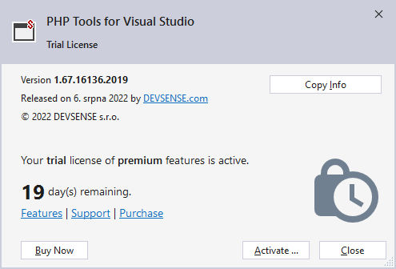
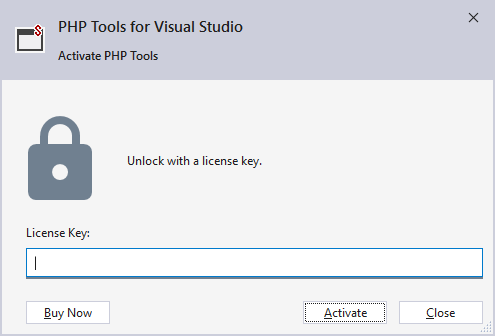
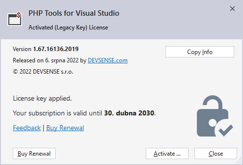

/*
Title: Product Activation
Description: Activate PHP Tools for Visual Studio
*/

# Product Activation

After [downloading PHP Tools for Visual Studio](https://www.devsense.com/download), and [installing it](../installation/index.md), the product license needs to be **activated**.

## Trial License

PHP Tools for Visual Studio comes with a free 30-day trial license, allowing to use all the features. The trial license is enabled automatically once Visual Studio starts.

You can check the state of the license in `Help` / `About PHP Tools` menu.

> Note, enabling the trial license requires an Internet connection.

## Obtain License Key

The license key can be purchased online from our [purchase page](https://www.devsense.com/purchase). For detailed information about licence types, licensing model, purchase, upgrades and renewal, see our [FAQ section](https://www.devsense.com/en/purchase#faq).

The license key is sent by email **immediately** after the payment.

## Enter License Key

Once you have a obtained the license key, activate your copy of *PHP Tools for Visual Studio*. The product can be activated from the Visual Studio menu.

- Go to `Help`/`Activate PHP Tools`, and the *Activation Dialog* will open.
- Paste the license key
- Click **`Activate`**

  

> Note, when you're offline, the [offline activation](offline-activation.md) window will appear, guiding you through the process of offline activation.

To check the status of your maintenance and support subscription, go to `Help`/`About PHP Tools`. [What's the maintenance and support subscription?](https://www.devsense.com/en/purchase/faq/upgrades-and-renewal#what-is-the-maintenance-and-support-subscription)

This window gives you information about your license status, product version and the option to renew your subscription.

## User Seats

Licenses are assigned to individual users and computers upon first activation. In the case a computer is no longer in use, or a user is no longer actively using the license, you can unregister them to free up their *seat* for another user. Visit the [**Dashboard**](https://www.devsense.com/account/dashboard) in the upper right corner of this web site to do so.

1. **Create a new user account** in the dashboard, or login using available social login.
2. In case there is no *License Key* listed in your Dashnoard, **Associate License Key** first.
3. Navigate to **Subscriptions** and adjust number of seats, or disable associated seats to free them for new users.

## Related Links

- [Offline Activation](offline-activation.md): How to activate the product license with a blocked Internet connection.
- [Licenses FAQ](https://www.devsense.com/en/purchase#faq): More information about licenses and purchases.
