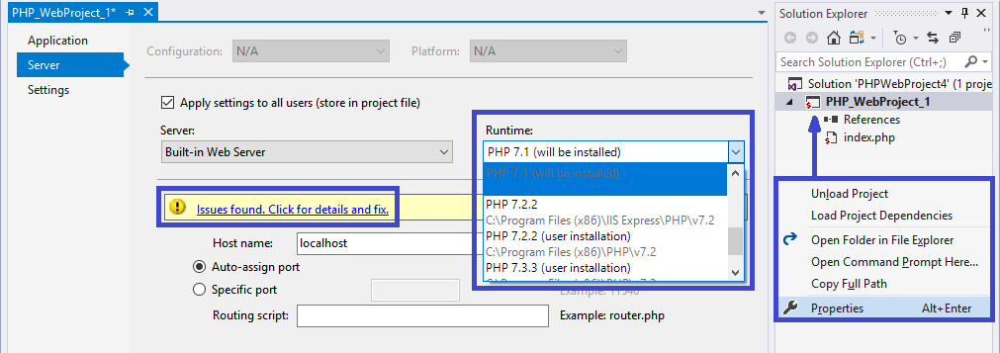
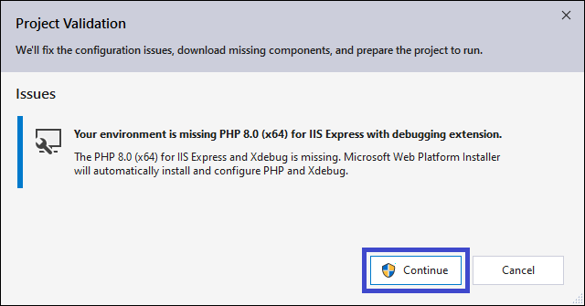
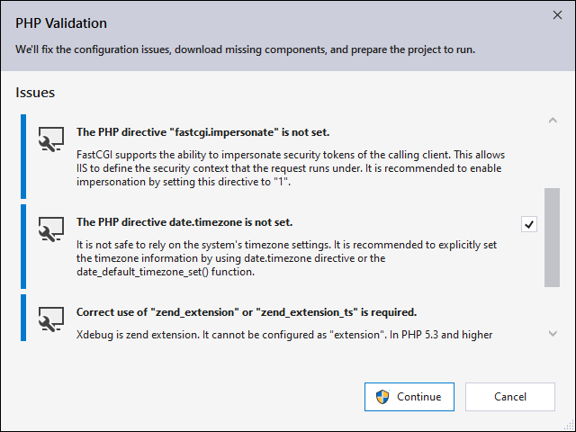

/*
Title: Installing PHP
Description: How to install PHP with PHP Tools for Visual Studio
*/

# Instalar PHP en PHP Tools para Visual Studio

Para ejecutar su programa localmente, se requiere que PHP esté instalado. Además, la extensión para PHP `Xdebug` también se necesita para poder utilizar  la función de depuración.

Hay diferentes maneras de tener su proyecto listo para ejecutar. Puede elegir de acuerdo al caso:

## Seleccionar e instalar la version PHP

Si aún no tiene PHP instalado, abra o cree un nuevo `Proyecto PHP` y luego haga clic en `Propiedades del proyecto`. Seleccione la versión de PHP que desea como se muestra en la imagen más abajo.

Haga clic en “guardar”. Para instalar PHP automáticamente, ejecute el proyecto con (<kbd>F5</kbd>) o haciendo clic en el mensaje de advertencia `Issues found. Click for details and fix` (Se encontraron problemas. Haga clic para más detalles y para reparar).

Debe tener acceso en modo administrador. Microsoft's Web Platform Installer instalará PHP junto con la extensión Xdebug ya configurada, la cual habilitará la función de depuración.

## Instalación con PHP previamente en el sistema

Si ya tiene instalado PHP, pero no se encuentra en la lista de las propiedades del proyecto (como se muestra en la primera imagen arriba), puede configurarlo para ser utilizado en Visual Studio. Haga clic en `Herramientas | Opciones` y navegue hasta `PHP Tools | Intérprete` como se muestra en la imagen más abajo.

En el cuadro de diálogo, puede elegir su propio directorio con el programa `php.exe` y reparar éste o cualquiera de los problemas de configuración.

> **Nota 1**: Esta opción puede no configurar Xdebug apropiadamente.

Para utilizar la versión PHP específica para su proyecto actual de PHP, vaya a las propiedades del proyecto y elija su directorio configurado de PHP.

> **Nota 2**: PHP analizará el archivo de configuración `php.ini`. 
La ubicación de `php.ini` se determina en varios pasos, de acuerdo al comportamiento de PHP. Si la ubicación no es la correcta, por favor compruebe lo siguiente:
>
> - La variable de entorno `PHPRC`, la cual obliga a PHP a utilizar `php.ini` en una ubicación específica. Se recomienda eliminar esta variable de entorno.
> - PHP busca `php.ini` en su directorio. Asegúrese de que el archivo `php.ini` existe.
> - PHP busca en algunas otras ubicaciones, como en el registro de sistema. Vea [http://php.net/manual/es/configuration.file.php](http://php.net/manual/es/configuration.file.php) para más información.

## En un servidor PHP remoto

Es posible ejecutar su proyecto en un equipo remoto o en un ambiente virtualizado, como un contenedor docker.

Instale su equipo remoto con las configuraciones de PHP y de Xdebug. Luego vaya a propiedades de proyecto de PHP y elija el servidor personalizado como se muestra en la imagen más abajo. Ingrese la dirección URL del equipo remoto y comienze su proyecto.

> **Nota**:asegúrese de que su proyecto PHP se implemente en el equipo remoto al comenzar el proyecto, o el directorio del proyecto esté asignado en el directorio de ese equipo remoto.

## Artículos relacionados

- [Configurar Xdebug](https://docs.devsense.com/es/vs/debugging/configuring-xdebug)
- [Proyecto nuevo a partir de código existente](https://docs.devsense.com/es/vs/project/from-existing-code)
