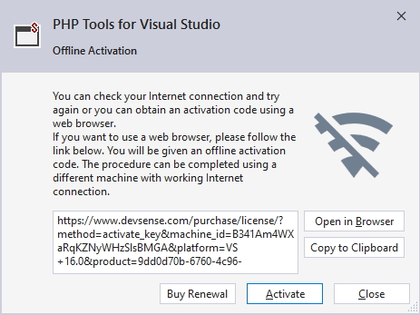
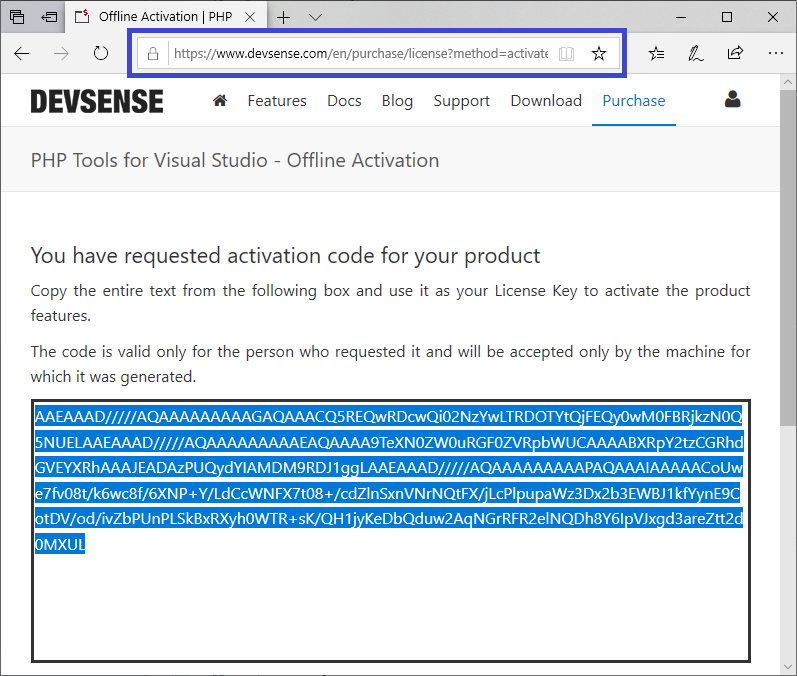
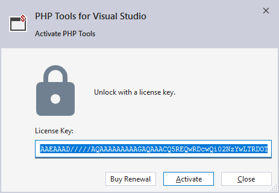

/*
Title: Product Offline Activation
Description: Activate PHP Tools for Visual Studio Offline
*/

## Activación sin conexión

En el caso de que no tuviera conexión a Internet disponible o el Internet es bloqueado por política de su compañía, la activación de PHP Tools también puede ser procesada en un navegador aparte o en otra máquina con conexión a Internet.

Para acceder a la activación sin conexión, siga los pasos de la activación normal ingresando su clave de licencia como se muestra en la imagen anterior. El cuadro de diálogo hará aparecer un mensaje que dice que no ha podido acceder al servidor, y proveerá una **URL alternativa**. Esta URL podrá ser copiada y abierta en un navegador con conexión a internet funcional (ver imagen abajo).

Luego de abrir la URL en el navegador, la página generará una clave (texto codificado) que puede ser copiado y pegado en el cuadro de diálogo de activación, en lugar de la clave de licencia normal.

> Nota: la clave sin conexión funcionará únicamente en la máquina que le dio la URL alternativa.

## Estatus de subscripción

Si quiere saber el estatus de sus subscripción, por favor visite [www.devsense.com/account/dashboard](https://www.devsense.com/account/dashboard).

Tendrá que crear una cuenta o ingresar con una cuenta existente de sus redes sociales para ver sus subscripción y el estatus de su licencia.

**Importante**: Cuando cree una cuenta en Devsense o ingrese con su cuenta de red social, debe utilizar **el mismo correo electrónico que utilizó para comprar la licencia**. Si no está seguro de cual correo electrónico utilizó, por favor, [contáctenos](mailto:info@devsense.com).
