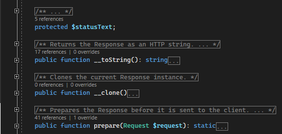

/*
Title: Code Lens
Description: Code Lenses.
*/

# Code Lens

CodeLens appears above functions, classes, interfaces, traits, properties, and constants. This margin provides quick contextual information about your code - references, implementations, overrides, or the method prototype. Upon clicking onto the text, the detailed window is opened.

## Quick navigation

Clicking on the code lens quickly jump to the corresponding symbol. In case there is more than one, a window with the list of symbols is opened.

## See also

- [Navigation Bar](navigation-bar.md)
- [Go To Definition](f12-gotodef.md)
- [Find All References](shift-f12-findallref.md)
- [F1 Help](f1-help.md)
