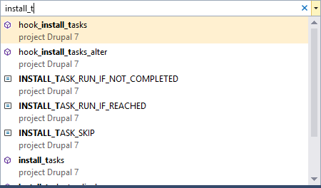

/*
Title: Navigate To
Description: Using NavigateTo (Ctrl+,)
*/

# Navigate To

The *Navigate To* feature lets the user go to any declaration or a file by typing its partial name.

## Using Navigate To

Pressing <kbd>Ctrl+,</kbd> opens the input box. When the keyboard cursor is placed over a word, the word is pre-inserted into the box.

The navigation searches immediately for all declarations containing the entered string. The search result can be filtered using the following rules:
- If the string is prepended with `$`, only global variables are listed.
- If there are upper-case characters, the search is case-sensitive.