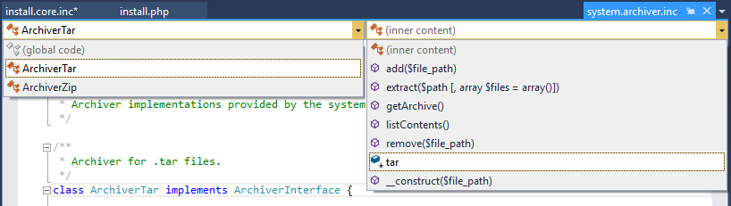

/*
Title: Navigation Bar
Description: Using Navigation Bar
*/

# Navigation Bar

Every PHP file opened in Visual Studio editor has the *Navigation Bar* at the top of the window. The navigation lists classes contained within the file, and for each class it lists the class members. Entries are sorted alphabetically.

A current selection within the navigation bar corresponds to the keyboard cursor position in the editor window.

## Using Navigation Bar

The *Navigation Bar* shows current location within the source code. Choosing a different entry in the navigation bar drop-down navigates to the corresponding declaration. If a drop-down is opened, typing the first letters of a declaration moves the selection to the first entry which its name starts by the typed prefix.

## Keyboard Shortcut

By default, there is a keyboard shortcut <kbd>Ctrl+F2</kbd> that moves the focus to the navigation bar. <kbd>Tab</kbd> key changes focus between first and second column and arrow keys and <kbd>Enter</kbd> can be used to navigate to a different item.