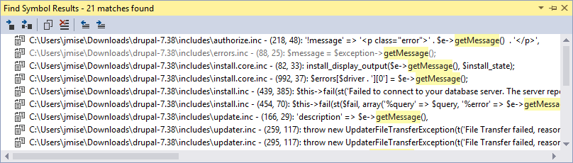

/*
Title: Find All References
Description: Using Find All References (Shift+F12)
*/

# Find All References

The *Find All References* window lists all the occurrences of a symbol. In case the reference is not sure, e.g. it is a part of a dynamic call or it is a part of a callback specified as a string, the occurrence is grayed.

The feature also looks into string values to match for function names or string parameters of `define()` or `constant()` to match for global constant names. Types and parameters within PHPDoc comments are also matched.

> **Note**: To improve finding class member references, use type hints or PHPDoc type hints. This helps the editor to resolve types more precisely.

## Using 'Find All References'

Navigate the keyboard cursor at a symbol like function name, variable, class name etc., and either press <kbd>Shift+F12</kbd> or right click the symbol and choose *Find All References*. If references can be resolved, a window with the resulting list is displayed, together with each occurrence location and text of the containing line.