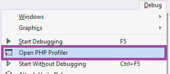
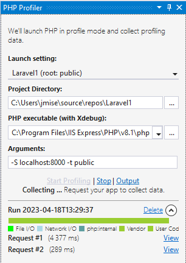
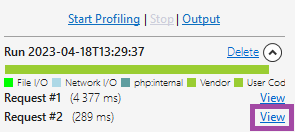

/*
Title: Overview
Description: Profiling PHP in Visual Studio overview.
Version: 1.73 and higher
*/

# Profiling PHP Overview

PHP code profiling allows you to inspect how much time and how many calls were made to every single function in the code.

## Requirements

Similarly to [debugging requirements](../debugging/configuring-xdebug.md), profiling requires a local installation of [`PHP` with `Xdebug`](../installation/install-php.md) extension.

- Local installation of PHP (7 - 8.0, or newer)
- [Xdebug PHP extension](http://xdebug.org/)

## Profiling Tool Window

Open **PHP Profiling** Tool Window in `Debug` / `Open PHP Profiler` menu.

The PHP Profiling tool window lets you start a PHP profiling session, inspect requests, and open profiling results in a separate [Profiler View](profiler-view.md).

- Choose `Launch Setting`, if you have a [PHP project](../project/new-project.md) opened.
- Specify `PHP executable` to run.
- Customize `Arguments` for the `php.exe`. By default, it's `"-S localhost:8000 -t ."` which starts a development server on `http://localhost:8000`.
- Click `Start Profiling` to launch `php.exe` with the specified arguments.
- In your browser, open `http://localhost:8000/` (by default) to collect profiling data.
  Each finished request is listed in the tool window with brief information. To display details, click `View`.
- Click `Stop`.

### Inspecting Profiling Data

Open details by clicking on `View`. This will open [Profiler View](profiler-view.md) with collected data.

### Opening Existing Profiling Results

In case the user has an existing profiling file (CacheGrind format, either uncompressed, or `gz` compressed), the file can be opened by drag&drop onto the _Profiling Tool Window_.

### Profiling PHPUnit Test

See [Profiling PHPUnit Tests](profiling-phpunit-tests.md) for details.

## See also

- [Profiler View](profiler-view.md)
- [Profiling PHPUnit Tests](profiling-phpunit-tests.md)
- [Installing PHP with Xdebug](../installation/install-php.md)
- [Custom Xdebug configuration](../debugging/configuring-xdebug.md)
