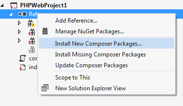
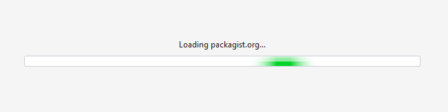
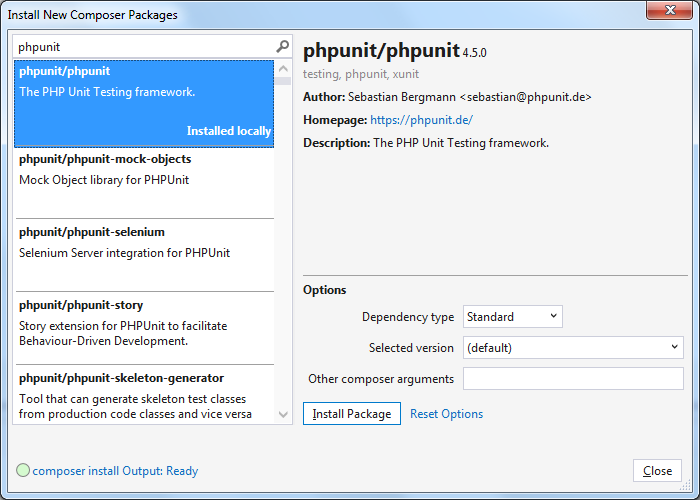
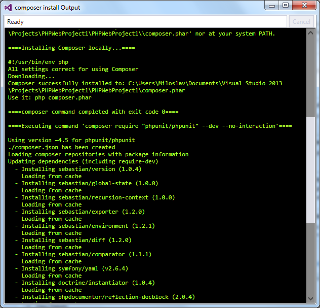
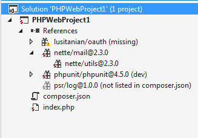
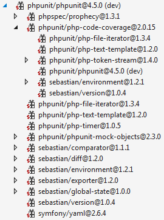
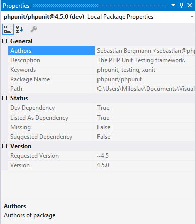
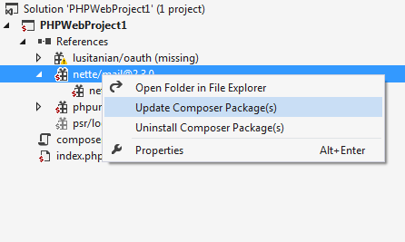
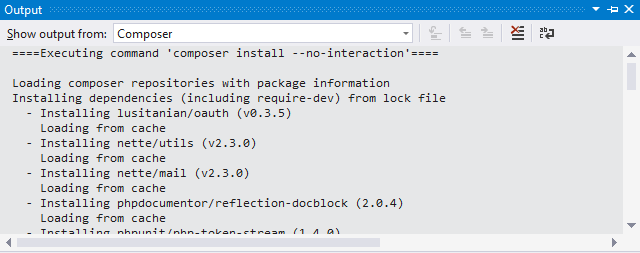

/*
Title: Composer
Description: Overview on how to use composer with PHP Tools for Visual Studio
Version: 1.15 and higher
*/

# Composer

PHP Tools for Visual Studio has an extensive package ecosystem support through integration with **Composer**. This allows you to install and manage packages to use them in your PHP project. To get yourself familiar with the basic Composer functionality please check [getcomposer.org](http://getcomposer.org/) to learn more. This text will assume you are familiar with it.

There are several ways you can work with Composer in PHP Tools for Visual Studio:

1. [Composer install package GUI](#browsinginstalling-new-composer-packages-in-the-gui) - for browsing/installing packages from the packagist.org repository
2. [Solution Explorer](#managing-installed-packages-in-solution-explorer) - for viewing/managing installed packages
3. [Composer in the Command Prompt](#composer-in-the-command-prompt) - for running composer the old-fashioned way (in cmd.exe)
4. [Composer log in Output pane](#composer-log-in-output-pane) - for viewing the output of composer commands in your Visual Studio session
5. [Composer in MSBuild](#composer-in-msbuild) - for hooking composer into msbuild process

## Browsing/Installing new composer packages in the GUI

PHP Tools for Visual Studio enables browsing in the package repository [packagist.org](http://packagist.org) directly within IDE. Right click on the **References** node of your PHP project in the **Solution Explorer**, and select **Install New Composer Packages...**



Before opening the dialog packages, information has to be loaded from [packagist.org](http://packagist.org) , which is usually very fast. If your connection is very slow you can close the dialog and continue your work, the process will continue on the background. You can see the progress in the [composer log in Output pane](#composer-log-in-output-pane).



Once packages information is loaded, you can search for the package you are interested in and install it. For example, you can install phpunit as shown in the picture bellow. Select dependency type development (it will add the package to `composer.json` under `require-dev`) and version default, which will install the latest release.


 
The command status indicator is located in the lower left-hand corner. You can immediately see if something went wrong with the executed command. Or if you wish to see the details about the installation, you can click on the link which will open the Composer Output Window. 
 


Composer will continue running in the background when you close the dialog (composer output will be printed to the composer log in the Output Window.) This applies to all composer commands executed within our IDE.

> **Note**: If you didn't have the `composer.json` file included in your project before, this command will add it. Same applies to all the other composer commands. Please note that you might want to include the `composer.lock` file manually as well, this depends on the type of your project. [Learn more about `composer.lock`](https://getcomposer.org/doc/01-basic-usage.md#composer-lock-the-lock-file)  

> **Known Issue**: Composer is using a ZipArchive extension which has a known issue when the path to the package is longer than 256 characters, hence, the package won't install and outputs the following message:
> 
> ```
> [ErrorException]
> ZipArchive::extractTo(LONG_PATH_TO_FILE): failed to open stream: No such file or directory
> ```
>
> A workaround is to install the package in the project with a shorter path. Then you will be able to install it also in this project as the package will be installed from the Composer cache.


## Managing Installed Packages in Solution Explorer

You can view and manage composer packages under the **References** node in the **Solution Explorer**. This reflects the content of project's `composer.json` file and the actual install status of the packages.
  


This particular view corresponds to following `composer.json` file:

```json
{
    "require-dev": {
        "phpunit/phpunit": "~4.5"
    },
    "require": {
        "nette/mail": "~2.3",
        "lusitanian/oauth": "0.3.*"
    }
}
```

There are a few **package status** icons in the **Solution explorer**:

- 
Installed and listed in the `composer.json`
- 
Extraneous: Installed, but not listed in the `composer.json`
- 
Missing: Listed in the `composer.json`, but not installed. PHP Tools also indicates when some of the required dependency packages are missing
- 
Replaced: Listed in the `composer.json`, but replaced by another package. The package itself is not present, but its functionality is replaced by another package. More about this feature at [composer documentation](https://getcomposer.org/doc/04-schema.md#replace) 

**Dependency type**: All the required packages appear directly under the **References** node. Development packages (defined by `require-dev` in `composer.json`) appear with (`dev`) after the name of the package.

You can expand the package node to browse its dependencies. You'll see all the required packages including the missing ones and installed development packages (you won’t see those as missing if they are not installed, only the top development packages are shown as missing).



You can inspect the properties of each package in the Properties pane



If you right click on a package node, there are couple of options:

- **Open folder in File Explorer**: Opens file explorer on the package directory
- **Update composer package(s)**:  Updates the selected the package(s)
- **Uninstall composer package(s)**:  Uninstall the selected the package(s)

	

## Composer in the command prompt

If you prefer to run commands in the command prompt yourself, you'd just need to start `cmd.exe` with a working directory set to your project root directory. Then you can run composer commands the old-fashioned way assuming you have `composer.phar` in your project root or installed globally (absolute path to `composer.phar` has to be present in the `PATH` environmental variable).

To get yourself familiar with all the available composer commands please visit [Command-line interface / Commands](https://getcomposer.org/doc/03-cli.md)

All commands are immediately reflected in the **Solution Explorer**

> **Note**: Direct edit of `composer.json` will cause that `composer.json` and `composer.lock` will be out of sync. This means that Composer will display a warning when executing an `install` command and nothing gets installed. You can either delete `composer.lock` or call `update` command instead.

## Composer log in Output pane

All composer commands executed in the **Visual Studio** outputs to the Composer Output pane. 

1. Open <span class="menu">View</span> → <span class="menu">Output</span>

2. In the **Show output from** drop-down, select **Composer**.

3. You should see something similar to the following:

	

This is very useful to debug any composer related issues.

## Composer in MSBuild
*Version 1.15 just supports MSBuild out-of-the-box for PHP Console and PHP Web Project for Microsoft Platforms*

You can enable the restoring of the missing Composer packages on build by adding this element to your phpproj file:

```xml
<InstallMissingComposerPackages>true</InstallMissingComposerPackages>
```

There is also one `DownloadComposerPhar` property which is by default turned on `true`, indicating whether to download `composer.phar` file if it is missing from the project root.

You can easily test this by running **Rebuild** on your PHP Project.

> **Note**: PHP Console project phpproj file has to contain `CoreCompile` target definition. 
```xml
<Target Name="CoreCompile" />
```

If you are interested, you can find Composer the target file on this location `$(MSBuildExtensionsPath32)\DEVSENSE\PHP Tools\VS$(VisualStudioVersion)\Devsense.Composer.targets`
