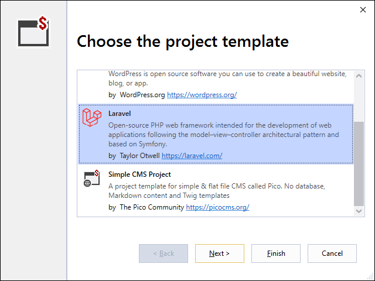
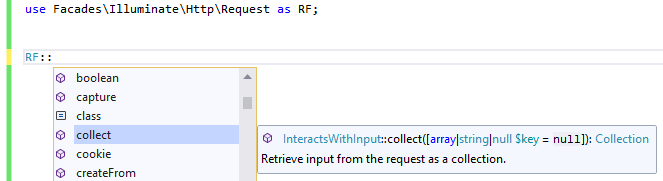
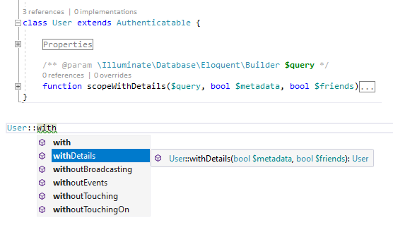

/*
Title: Laravel Support
Description: Features to support Laravel Development.
Version: 1.66 and higher
*/

# Laravel

*Laravel* is one of the most common PHP frameworks allowing developers to quickly built a small or a large scale web application. Its main benefit is the vast array of prebuilt features and extensive set of functions that are ready to be used.

## New Project

To start a project from scratch, use the [New Project Wizard](new-project.md).

In the New Project dialog, choose `PHP Web Project`, and choose the **`Laravel`** project template.

## Opening Existing Laravel Project

In case you already have a Laravel project, follow the [Project from Existing Code](from-existing-code.md) instructions.

You can calso directly open the folder with your project (`File` / `Open` / `Folder`), but this won't create a regular Visual Studio project so you won't have all the project features.

## Facades

Laravel code takes advantage of so-called *facades*. A facade class provides methods of its service container. The mechanism of services and facade accessors is handled by PHP Tools and works out of the box.

### Service Containers

PHP Tools is scanning the project for registered services and resolves the facade accessors classes correspondingly.

### Real-Time Facades

PHP Tools recognizes use of class names prefixed with `Facades\` name; such classes are treated as a real-time facades (if the corresponding class exists), and provides IntelliSense and code validation.

## Eloquent Local Scopes

The editor recognies [Eloquent's Local Scopes](https://laravel.com/docs/9.x/eloquent#local-scopes), i.e. functions prefixed with `scope` in the Eloquent Model. Those functions show up in the IntelliSense as they should be used.

The editor scans for the local scopes (the functions prefixed with `scope` on a class that implements `Illuminate\Database\Eloquent\Model` or on a trait that is used within a `Model` class); such functions are displayed in the IntelliSense and also recognized by the code analysis.

## Code Analysis

The entire project is continuously analysed for errors with respect to Laravel documentary comments notation, and the use of latest PHP features.

By default, the project `vendor/` folder is excluded from the code analysis. This can be enabled in `Tools` / `Options`, under the `PHP Tools` section.

> The editor supports commonly used features for extending IDEs and Laravel projects in general, such as, `@mixin` PHPDoc tag, `@method` PHPDoc tag, and `@template` PHPDoc tag for annotating generic types, `.phpstorm.meta` file.

## Debugging

Ensure, the project web root is set correctly. Go to `Project` / `Properties`, the `Application` tab, and make sure the `Web Root` is set to `public`.

Run the project with `Debug` / `Start Debugging` (`F5`) command. PHP Tools will start the development web server and initiate the debugging on a localhost address.

In order to attach to a remote server, or a local web server, go to `Project` / `Properties`, the `Server` tab, and choose `Custom`.

## barryvdh/laravel-ide-helper

There is a commonly used composer package `barryvdh/laravel-ide-helper` providing additional features for IDEs. Although it is not necessary since *PHP Tools* already deal with facades and services, the package contains some additional artisan commands and features. See the project repository for more information on how to use it at https://github.com/barryvdh/laravel-ide-helper.

When creating a new Laravel project using [New Project Wizard](new-project.md), the `barryvdh/laravel-ide-helper` is already preinstalled. Also, when opening a laravel project, the ide-helper gets regenerated automatically.

## See Also

- [Composer Package Management](composer.md)
- [Project from Existing Code](from-existing-code.md)
