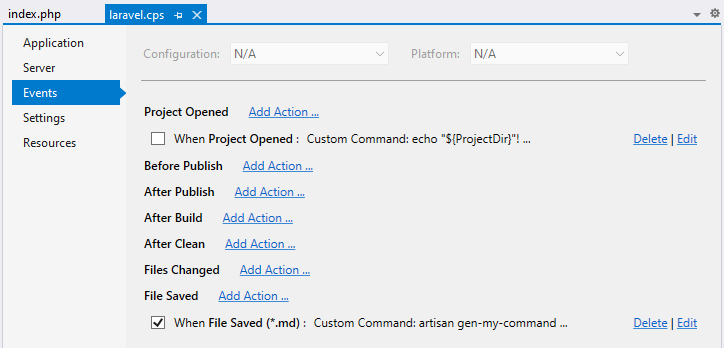
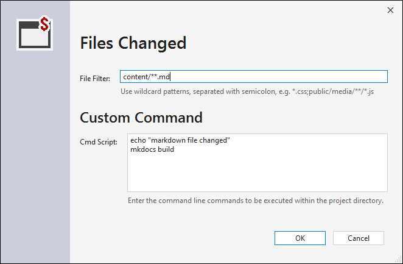

/*
Title: Events
Description: Project Events Configuration
*/

## Project Events

An important part of the project work flow is automatization. **`Events`** project property page allows to customize actions triggered upon certain events. The page can be opened in `Project`/`Properties`:

The following triggers are available to choose from:

- `Project Opened` gets triggered when a project is opened in Visual Studio.
- `Before Publish` is called before publish (i.e. upload pending changes) gets started.
- `After Publish` gets called after the publish.
- `After Clean` is triggered by Project / Clean command.
- `Files Changed` happens when a file is modified both inside or outside Visual Studio.
- `File Saved` is triggered by saving a file inside Visual Studio.

Creating or editing events looks like the following dialog. The sample below shows the action `Custom Command` triggered upon `Files Changed` event:

## Actions

Each event can trigger an action.

### Publish

`Publish` uploads pending changes using selected remote profile. In case of `File Saved` trigger, only the specific saved file gets uploaded.

Details of the upload process is logged into `Output` tool window, under the `Publish` category.

### Custom Command

`Custom Command` allows to enter a custom command line commands (script). The script has path to the project's `php.exe` (selected in `Application` project property page) in its %PATH% environmental variable.

Current working directory (cwd) is set to the project root directory.

Optionally, the script can use variables in the format `${name}` which will be replaced with the corresponding value.

| Variable | Value |
| --- | --- |
| `${ProjectDir}`| full directory path of the project, ending with `\`. |
| `${ProjectName}` |  the project name. |
| `${ProjectUrl}` | the Web Project URL |
| `${PhpExe}` | full path to `php.exe` selected in project properties. In case the project is set to `Custom` server, the variable is not defined. |

## Related Links

- [Automatic Publish](remote-explorer.md#automatic-upload)
