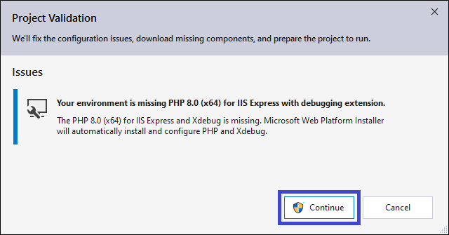
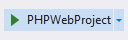
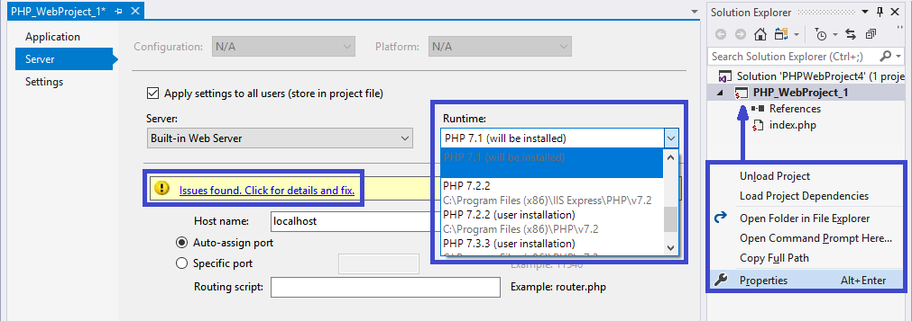
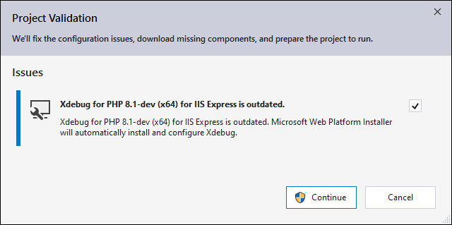
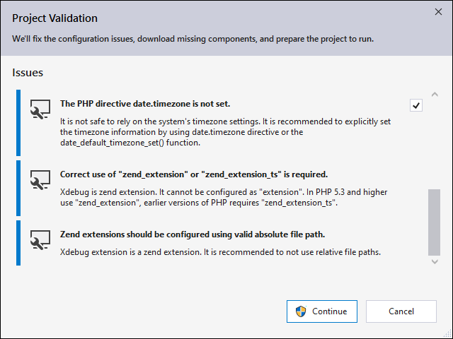

/*
Title: Project Validation
Description: Validation and Fixing Project Configuration and Setup Issues
*/

# Project Validation

Automatic project validation ensures, that the project has a valid PHP executable, debugging properly configured, the web server is working, and more. All the requirements, including installed PHP itself, are handled, and upon user's configuration resolved by PHP Tools.

## Opening Project Validation

The project validation is opened at several places:

**When Running the Project**

Starting the project either with or withouth Debugging validates the project first. If any blocking issue occurs (such as missing debugging extension or missing PHP completely), the validation dialog appears before debugging starts.

**In Project Properties**

Project Properties, tab **Server**, provides selection of available PHPs and servers to run the project on. In case a local PHP installation is selected, and an issue is found, the Properties window shows a corresponding message that provides more information and the validation dialog.

**In Options**

The Visual Studio **Options** window provides **PHP Tools** / **Default PHP** option page. If the chosen PHP executable has configuration issues, the appropriate message will appear. Upon clicking, the validation dialog appears as well.

## PHP with Xdebug

When using **Built-in** PHP web server, or **IIS**, or **IIS Express**, the PHP and debugging extensions gets validated and an automatic update is provided. Upon clicking `Continue`, the newest PHP binaries are downloaded and existing files updated.

## PHP Configuration

Common configuration issues or missing directives are handled, and corresponding fixes provided. upon clicking `Continue`, listed settings gets fixed.

## PHP Extensions

In case project required PHP extensions are detected (for example when specified in the corresponding `composer.json`), the dialog appears. This allows to quickly fix and enable listed extensions.

## IIS Site Setup

When the project is configured to run on IIS or IIS Express, the project is validated whether the virtual directory was properly setup. Possible quick fixes allow besides others to create the virtual directory, or to install developer certificate.
