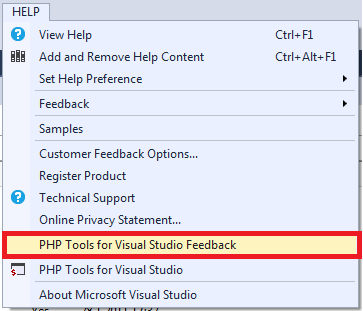

/*
Title: Comentarios
Description: Sending a feedback from Visual Studio
*/

# Comentarios

Hemos integrado un formulario que ayuda a enviar preguntas, sugerencias o reportar problemas de manera rápida y fácil. Junto con su comentario, nuestro equipo puede recibir opcionalmente una captura de pantalla del lugar de trabajo actual e información básica del sistema. Esto ayuda a resolver problemas con el menor número de pasos posible.

Por favor, ingrese en `Ayuda | PHP Tools for Visual Studio - Comentarios`, y háganos saber lo que piensa.

