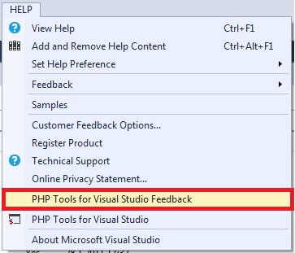

/*
Title: Feedback
Description: Sending a feedback from Visual Studio
*/

# Feedback

We have Integrated a feedback form that helps to send questions, suggestions or report issues quickly and easily. Together with your feedback message, our team can optionally receive a screenshot of the current workplace and basic system information. This helps to resolve issues with as few steps as possible.

Please go to menu `Help | PHP Tools for Visual Studio Feedback`, and let us know what you think.

