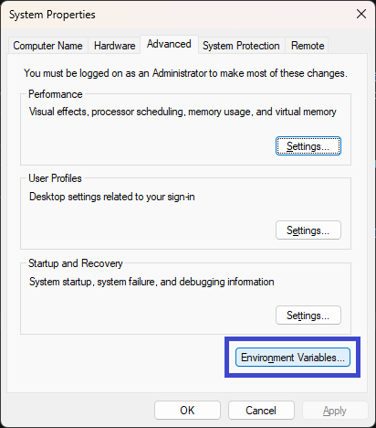
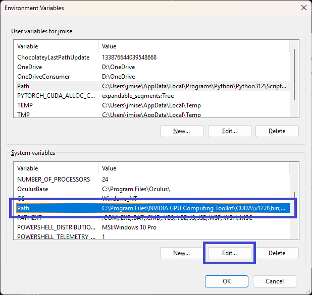
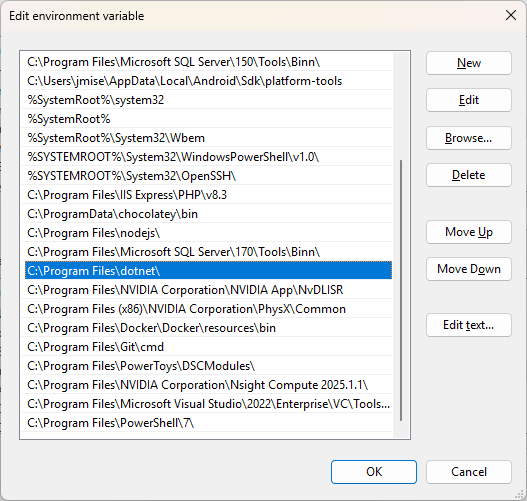

# `Microsoft.NET.Sdk` Not Found

## Problem

When opening a PHP project, the following error appears in the Output window:

> The SDK 'Microsoft.NET.Sdk' specified could not be found. ...

## Usual Cause

.NET is a Visual Studio component required to open modern PHP projects.

This component can break after Visual Studio updates, usually when multiple Visual Studio versions are installed side by side. By default, .NET is located in `C:\Program Files\dotnet\` (or `%ProgramFiles%\dotnet\`), and the `PATH` environment variable points to this location.

However, installing a 32-bit version may alter `PATH` so it also contains `C:\Program Files (x86)\dotnet\`, sometimes **before** the correct `C:\Program Files\dotnet\` entry.

## Solution 1

Recommended fix: Remove the **x86** alternative `C:\Program Files (x86)\dotnet\` (or `%ProgramFiles(x86)%\dotnet\`) from the `PATH` environment variable.

Open _Advanced System Settings_ (Windows `Settings` -> `System` -> `About`, then click `Advanced system settings`).

Make sure there is no `C:\Program Files (x86)\dotnet\` entry (the x86 alternative).

Click `OK`, then restart Visual Studio.

## Related Links

- https://learn.microsoft.com/en-us/answers/questions/1184941/the-sdk-microsoft-net-sdk-specified-could-not-be-f
- https://stackoverflow.com/questions/67049414/