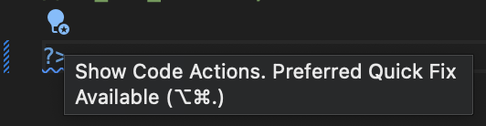
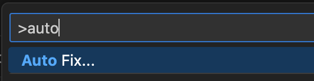
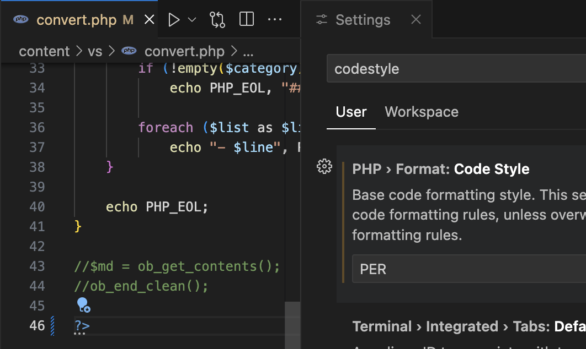

# Enable Auto-Fix

Code actions can be applied automatically as auto-fix or on file save.

## Set Code Action as Auto-Fix

Set the code action convention to `autofix` in the `.editorconfig` file, as shown on example below:

```ini
[*.php]
php_remove_redundant_closing_tag=autofix
```

This applies the code action as automatic (preferred) fix. Such actions can be applied using `Auto Fix ...` command, and marked with a blue light bulb (by default).





## Auto-Fix on File Save

Code actions marked as _autofix_ can be applied automatically on file save using the following setting:

```json
"editor.codeActionsOnSave": {
    "source.fixAll": "explicit" 
}
```

## Auto-Fix and Code Style

Setting a code style (setting `"php.format.codeStyle"`) may enable auto-fix on code actions that are required by the selected code style. For example setting `PER` code style implicitly enables _"Remove Redundant Closing Tag `?>`"_ code action.



In future update, code style may also change the [severity](severity) of code code actiun, so it will appear as error.

## See Also

- [severity](Code Actions Severity)
- [hide-code-action](Hide Code Actions)
- [list](List of available code actions conventions)
