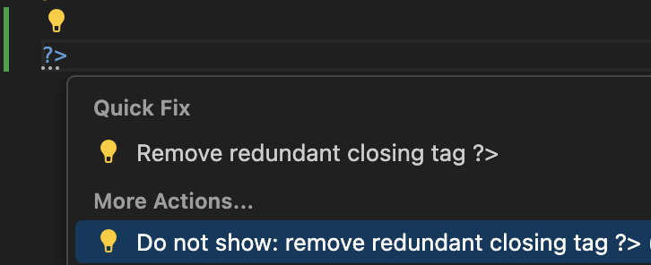

/*
Title: Hide Code Action
Description: How to hide a code action.
*/

# Hide Code Action

Code actions may be disruptive or not needed. The following article describes various ways of hiding them.

## Hide Specific Code Action

### Using Settings

- Code action "Don't show ..."
    
- Setting `"php.problems.exclude"`.

    _Example:_
    ```json
    "php.problems.exclude": { "/": ["php_remove_redundant_closing_tag"] }
    ```

### Using `.editorconfig`

Add convention for the code action, specify value `false`:
```ini
[*.php]
php_remove_redundant_closing_tag=false
```

## Hide All Code Actions

### Using Settings 

- Setting `""php.problems.exclude"": { "/": [7103] }` disables all code hints (unless the code action is explicitly enabled using `.editorconfig` file).
- Setting `""phpTools.suppressPremiumFeatures"": true` hides all premium features including code actions and code hints.

## See Also

- [Code Actions Severity](severity)